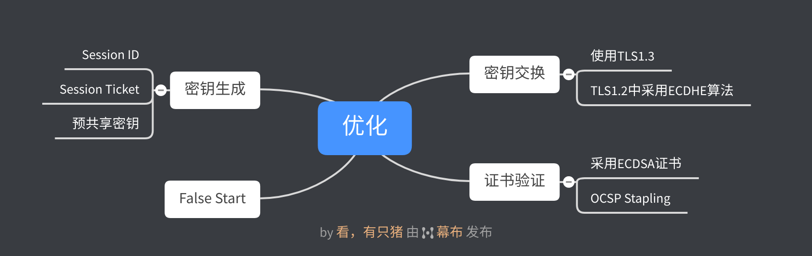

# HTTP协议学习笔记(八) HTTPS优化

## 0X00 梗概

HTTPS连接的大致上可以分为两部分：非对称加密握手和握手后对称加密报文传输。其中非对称加密握手中消耗了大量时间，主要消耗在三个方面：

- 密钥交换：生成密钥交换的临时公钥对。
- 证书验证：验证证书时需要获取CRL或OCSP。
- 密钥生成：需要消耗响应的算力来计算`Pre-Master`。

为了提升HTTPS连接的性能，必须要从这三个方面进行优化。

## 0X01 密钥交换

TLS协议方面尽可能使用TLS 1.3，因为它只需要`1-RTT`就能完成握手，而且更安全。如果只能使用TLS 1.2，密钥交换算法尽可能选用ECDHE算法(运算速度快、安全性高)，并且椭圆曲线优先选择X25519。在对称加密算法中，选择`AES_128_GCM`。可以通过Nginx进行相关配置：

```nginx
# 配置支持的密码套件，越靠前优先级越高
ssl_ciphers TLS13-AES-256-GCM-SHA384:TLS13-CHACHA20-POLY1305-SHA256:EECDH+CHACHA20；
# 配置椭圆曲线
ssl_ecdh_curve X25519:P-256;
```

## 0X02 证书验证

服务器需要将自己的证书链发送给客户端，客户端接收后进行验证。这里有两个优化点：

- 证书传输：证书传输方面，可以采用ECDSA证书，相比RSA证书，ECDSA证书体积小且所需运算量小。
- 证书验证：验证证书需要去访问CRL或OCSP数据，因此需要消耗好几个RTT。由于CRL是由CA机构定期发布，并且包含了所有被取消的证书，因此存在时间窗口的安全隐患和体积过大，通常都采用OCSP，在线验证证书是否有效。可以通过`OCSP Stapling`(OCSP装订)，由服务器先访问CA获取OCSP响应，握手时随证书一起发送，减少了客户端发起请求的耗时。

## 0X03 密钥生成

密钥生成阶段的优化主要采用会话复用，即通过缓存第一次握手计算的`Master Secret`，避免每次建立连接时，都进行握手。会话复用分为三种：

- `Session ID`

  服务器和客户端建立连接受，各自保存一个会话ID，服务器内存中存储主密钥和其他信息。客户端再次连接时，发送会话ID，服务器从内存中找到后，使用主密钥恢复会话状态，只用一个消息往返就可以建立安全通信。由于Session信息存储在内存中，因此并发量很大的服务器难以承受。

- `Session Ticket`

  Ticket类似Cookie，由客户端负责存储。服务器加密会话信息后，发送给客户端保存。重连时，客户端使用`session_ticket`发送Ticket，服务器解密验证后，恢复会话。由于Ticket使用固定的密钥加密Ticket，为了保证前向安全，密钥会定期更换。

- 预共享密钥`PSK`

  `Session ID`、`Session Ticket`只能实现`1-RTT`。PSK是`Session Ticket`的强化版，重连时，客户端同时带上应用数据和`Session Ticket`，`Session Ticket`由`pre_shared_key`字段保存。使用PSK能实现`0-RTT`，TLS 1.3只支持PSK。

  采用PSK容易受到重放攻击，黑客可以反复向服务器发送截获的数据，因此预共享密钥只允许在安全方法GET、HEAD中使用。通过在消息中添加时间戳、`nonce验证`或一次性票证限制重放。

总的来说，这三种技术都是采用缓存来实现的：

- `Session ID`将密钥缓存在服务器内存中，通过`ID`与之关联，连接数受服务器内存限制。
- `Session Ticket`将密钥缓存在客户端，客户端重连时需要发送Ticket，验证通过后，会话恢复。为了保证前向安全，加密Ticket的密钥需要及时更换。
- `PSK`是`Session Ticket`的强化版，客户端重连时，发送数据的同时也附带Ticket，减少了一次RTT。

## 0X04 False Start

通常情况下，客户端发送`ChangeCipherSpec`和`Finished`后，处于等待状态，直到服务器的ACK到达后，才会通过对称加密传输数据。采用`False Start`后，客户端发送`ChangeCipherSpec`和Finished后，立即发送加密数据，节约了一个RTT。

## 0X05 总结



## 0x06 参考

- 官方文档：http://nginx.org/en/docs/http/ngx_http_ssl_module.html
- 浏览器打开TLS 1.3：https://geekflare.com/enable-tls-1-3-in-browsers/
- Cerbot nginx配置：https://github.com/certbot/certbot/blob/master/certbot-nginx/certbot_nginx/tls_configs/options-ssl-nginx-tls13-session-tix-on.conf
- SSL评分工具：https://www.ssllabs.com
- 浏览器支持套件：https://ssl.haka.se
- JerryQu博文：https://imququ.com/post/enable-tls-1-3.html


