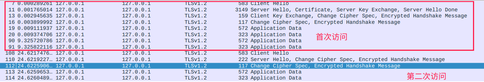
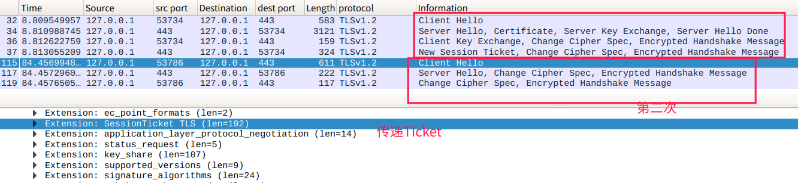
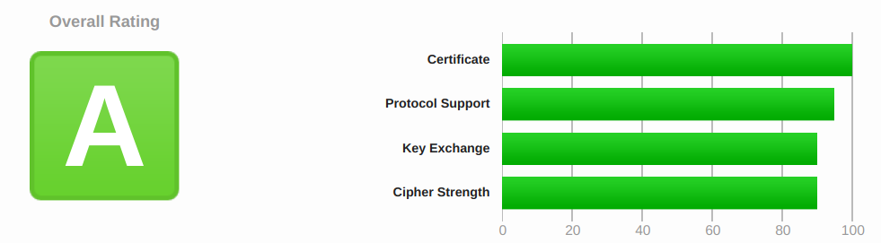

# HTTP协议学习笔记(八) HTTPS优化

## 0X00 梗概

HTTPS连接的大致上可以分为两部分：非对称加密握手和握手后对称加密报文传输。其中非对称加密握手中消耗了大量时间，主要消耗在三个方面：

- 密钥交换：生成密钥交换的临时公钥对。
- 证书验证：验证证书时需要获取CRL或OCSP。
- 密钥生成：需要消耗响应的算力来计算`Pre-Master`。

为了提升HTTPS连接的性能，必须要从这三个方面进行优化。

## 0X01 密钥交换

TLS协议方面尽可能使用TLS 1.3，因为它只需要`1-RTT`就能完成握手，而且更安全。如果只能使用TLS 1.2，密钥交换算法尽可能选用ECDHE算法(运算速度快、安全性高)，并且椭圆曲线优先选择X25519。在对称加密算法中，选择`AES_128_GCM`。可以通过Nginx进行相关配置：

```nginx
# 配置支持的密码套件，越靠前优先级越高
ssl_ciphers TLS13-AES-256-GCM-SHA384:TLS13-CHACHA20-POLY1305-SHA256:EECDH+CHACHA20；
# 配置椭圆曲线
ssl_ecdh_curve X25519:P-256;
```

## 0X02 证书验证

服务器需要将自己的证书链发送给客户端，客户端接收后进行验证。这里有两个优化点：

- 证书传输：证书传输方面，可以采用ECDSA证书，相比RSA证书，ECDSA证书体积小且所需运算量小。
- 证书验证：验证证书需要去访问CRL或OCSP数据，因此需要消耗好几个RTT。由于CRL是由CA机构定期发布，并且包含了所有被取消的证书，因此存在时间窗口的安全隐患和体积过大，通常都采用OCSP，在线验证证书是否有效。可以通过`OCSP Stapling`(OCSP装订)，由服务器先访问CA获取OCSP响应，握手时随证书一起发送，减少了客户端发起请求的耗时。

## 0X03 会话复用

会话复用是通过缓存第一次握手计算的`Master Secret`，避免每次建立连接时，都进行握手。会话复用分为三种：

- `Session ID`

  服务器和客户端建立连接受，各自保存一个会话ID，服务器内存中存储主密钥和其他信息。客户端再次连接时，发送会话ID，服务器从内存中找到后，使用主密钥恢复会话状态，只用一个消息往返就可以建立安全通信。由于Session信息存储在内存中，因此并发量很大的服务器难以承受。

- `Session Ticket`

  Ticket类似Cookie，由客户端负责存储。服务器加密会话信息后，发送给客户端保存。重连时，客户端使用`session_ticket`发送Ticket，服务器解密验证后，恢复会话。由于Ticket使用固定的密钥加密Ticket，为了保证前向安全，密钥会定期更换。

- 预共享密钥`PSK`

  `Session ID`、`Session Ticket`只能实现`1-RTT`。PSK是`Session Ticket`的强化版，重连时，客户端同时带上应用数据和``Session Ticket`，`Session Ticket`由`pre_shared_key`字段保存。使用PSK能实现`0-RTT`，TLS 1.3中，只支持PSK。

  采用PSK容易受到重放攻击，黑客可以反复向服务器发送截获的数据。因此预共享密钥只允许在安全方法GET、HEAD中使用，通过在消息中添加时间戳、`nonce验证`或一次性票证限制重放。

总的来说，这三种技术都是采用缓存来实现的：

- `Session ID`将密钥缓存在服务器内存中，通过`ID`与之关联，连接数受服务器内存限制。
- `Session Ticket`将密钥缓存在客户端，客户端重连时需要发送Ticket，验证通过后，会话恢复。为了保证前向安全，加密Ticket的密钥需要及时更换。
- `PSK`是`Session Ticket`的强化版，客户端重连时，发送数据的同时也附带Ticket，减少了一次RTT。

## 0X04 False Start

通常情况下，客户端发送`ChangeCipherSpec`和`Finished`后，处于等待状态，直到服务器的ACK到达后，才会通过对称加密传输数据。采用`False Start`后，客户端发送`ChangeCipherSpec`和Finished后，立即发送加密数据，节约了一个RTT。

## 0X05 实验准备

该实验的准备条件是：

- 操作系统：Ubuntu
- 抓包工具：Wireshark

我们将在该实验中进行如下实现：

- 安装`Nginx`
- 搭建`HTTPS`
- 实践`Session ID`
- 实践`Session Ticket`
- 实践`PSK`(Nginx暂不支持)
- 实践`False Start`
- 实践`OCSP Stapling`

## 0X06 实验

- 安装`Nginx`

    ```bash
    # 下载源码，下载地址https://nginx.org/en/download.html
    ➜  nginx_source wget https://nginx.org/download/nginx-1.16.1.tar.gz
    # 解压源码
    ➜  nginx_source tar -zxvf nginx-1.16.1.tar.gz
    ➜  nginx-1.16.1 cd nginx-1.16.1
    # 安装依赖
    ➜  nginx-1.16.1 sudo apt install libpcre3 libpcre3-dev
    ➜  nginx-1.16.1 sudo apt install zlib1g zlib1g-dev
    ➜  nginx-1.16.1 sudo apt install openssl 
    # 生成配置文件
    ➜  nginx-1.16.1 ./configure --prefix=/usr/local/nginx  --with-http_ssl_module
    # 编译并安装
    ➜  nginx-1.16.1 sudo make & make install
    # 测试nginx
    ➜  nginx-1.16.1 cd /usr/local/nginx/sbin/
    # 启动
    ➜  sbin ./nginx
    # 发送请求测试
    ➜  sbin curl 127.0.0.1 
    <!DOCTYPE html>
    <html>
    <head>
    <title>Welcome to nginx!</title>
    ....
    ```

- 搭建`HTTPS`
    ```nginx
    # 获取证书(我的证书从阿里云购买)
    # 将证书解压到/usr/local/nginx/cert中
➜  nginx sudo unzip -d /usr/local/nginx/cert 2964374_www.fangjie.site_nginx.zip
    # 配置防火墙
    # 查看防火墙状态
    ➜  nginx ufw status
Status: active
    
    To                         Action      From
    --                         ------      ----
22/tcp                     ALLOW       Anywhere                  
    6088/tcp                   ALLOW       Anywhere                  
    22/tcp (v6)                ALLOW       Anywhere (v6)             
6088/tcp (v6)              ALLOW       Anywhere (v6)             
    # 允许访问本机80端口
    ➜  nginx sudo ufw allow from any to any port 80 proto tcp
    Rule added
    Rule added (v6)
    # 允许访问443端口
➜  nginx sudo ufw allow from any to any port 443 proto tcp
    Rule added
    Rule added (v6)
    ➜  nginx ufw status
    Status: active

    To                         Action      From
    --                         ------      ----
    22/tcp                     ALLOW       Anywhere                  
    6088/tcp                   ALLOW       Anywhere                  
    80/tcp                     ALLOW       Anywhere                  
    443/tcp                    ALLOW       Anywhere                  
    22/tcp (v6)                ALLOW       Anywhere (v6)             
    6088/tcp (v6)              ALLOW       Anywhere (v6)             
    80/tcp (v6)                ALLOW       Anywhere (v6)             
    443/tcp (v6)               ALLOW       Anywhere (v6)
    # 配置host，进行域名解析后，可忽略
    # 只适用与用本机实验，将fangjie.site映射到127.0.0.1
    ➜  nginx echo '127.0.0.1 fangjie.site' >> /etc/hosts
    
    # 编辑配置文件 /usr/local/nginx/conf/nginx.conf
    worker_processes  1;

    events {
        worker_connections  1024;
    }
    
    http {
        include       mime.types;
        default_type  application/octet-stream;
    
        sendfile        on;
        keepalive_timeout  65;
    
        server {
           listen 443 ssl;
           server_name fangjie.site www.fangjie.site;
           ssl_certificate /usr/local/nginx/cert/www.fangjie.site.pem;
           ssl_certificate_key /usr/local/nginx/cert/www.fangjie.site.key;
    
            location / {
                root   html;
                index  index.html index.htm;
            }
    
            error_page   500 502 503 504  /50x.html;
            location = /50x.html {
                root   html;
            }
        }
    }
    # 重启nginx
    ➜  conf ../sbin/nginx -s reload
    # 验证
    ➜  sbin curl https://fangjie.site
    <!DOCTYPE html>
    <html>
    <head>
    <title>Welcome to nginx!</title>
    ....
    ```
    
- `Session ID`
	
  ```nginx
    # 编辑配置文件 /usr/local/nginx/conf/nginx.conf
    worker_processes  1;
    
    events {
    worker_connections  1024;
    }
    
    http {
        include       mime.types;
    default_type  application/octet-stream;
    
        sendfile        on;
    keepalive_timeout  65;
    
        server {
           listen 443 ssl;
           server_name fangjie.site www.fangjie.site;
           ssl_certificate /usr/local/nginx/cert/www.fangjie.site.pem;
           ssl_certificate_key /usr/local/nginx/cert/www.fangjie.site.key;
           # 打开session缓存
           ssl_session_cache shared:SSL:1m;
           ssl_session_timeout 5m;
           # 关闭session ticket 避免干扰
           ssl_session_tickets off;
           location / {
                #root   html;
                #index  index.html index.htm;
                # 返回其Session ID
            return  200 "$ssl_session_id,$ssl_session_reused";
        }
    
            error_page   500 502 503 504  /50x.html;
            location = /50x.html {
                root   html;
            }
        }
    }
    # 重启nginx
    ➜  conf ../sbin/nginx -s reload
    # 验证
    启动浏览器，先后访问https://fangjie.site
  ```
  
    通过wireshark对`127.0.0.1:443`抓包，第二次没有`Client Key Exchange`，双方直接切换到对称加密中。
  
    
  
  访问时，下载的两个文件也可以确认`Session ID`相同，这个ID也与第二次访问的`Client Hello`中的`Session ID`相同。
	
- `Session Ticket`

  ```nginx
  # 生成ticket加密秘钥
  ➜  conf openssl rand 80 > ../cert/ticket.key
  # 编辑配置文件 /usr/local/nginx/conf/nginx.conf
  worker_processes  1;
  
  events {
      worker_connections  1024;
  }
  
  http {
      include       mime.types;
      default_type  application/octet-stream;
  
      sendfile        on;
      keepalive_timeout  65;
  
      server {
          listen 443 ssl;
          server_name fangjie.site www.fangjie.site;
          ssl_certificate /usr/local/nginx/cert/www.fangjie.site.pem;
          ssl_certificate_key /usr/local/nginx/cert/www.fangjie.site.key;
          # 关闭Session缓存
  	    ssl_session_cache off;   
          ssl_session_tickets on;
          ssl_session_ticket_key /usr/local/nginx/cert/ticket.key;      
          location / {
              root   html;
              index  index.html index.htm;
      	}
  
          error_page   500 502 503 504  /50x.html;
          location = /50x.html {
              root   html;
          }
      }
  }
  # 重启nginx
  ➜  conf ../sbin/nginx -s reload
  # 验证
  启动浏览器，先后访问https://fangjie.site
  ```
  
  通过wireshark对`127.0.0.1:443`抓包，第一次访问后，服务器通过`New Session Ticket`传递加密后的ticket给客户端。客户端第二次访问时，使用`Client Hello`传递Ticket给服务器验证。
  
  

- 实践`False Start`

  ```nginx
  # 编辑配置文件 /usr/local/nginx/conf/nginx.conf
  worker_processes  1;
  
  events {
      worker_connections  1024;
  }
  
  http {
      include       mime.types;
      default_type  application/octet-stream;
  
      sendfile        on;
      keepalive_timeout  65;
  
      server {
      	listen 443 ssl;
      	server_name fangjie.site www.fangjie.site;
      	ssl_certificate /usr/local/nginx/cert/www.fangjie.site.pem;
      	ssl_certificate_key /usr/local/nginx/cert/www.fangjie.site.key;
          # 关闭Session缓存
          # 打开false start
          ssl_prefer_server_ciphers on;  
          # 设置密码套件
          ssl_ciphers EECDH+ECDSA+AESGCM:EECDH+aRSA+AESGCM:EECDH+ECDSA+SHA256:EECDH+aRSA+SHA256:EECDH+ECDSA+SHA384:EECDH+ECDSA+SHA256:EECDH+aRSA+SHA384:EDH+aRSA+AESGCM:EDH+aRSA+SHA256:EDH+aRSA:EECDH:!aNULL:!eNULL:!MEDIUM:!LOW:!3DES:!MD5:!EXP:!PSK:!SRP:!DSS:!RC4:!SEED;    
          location / {
              root   html;
              index  index.html index.htm;
      	}
  
          error_page   500 502 503 504  /50x.html;
          location = /50x.html {
              root   html;
          }
      }
  }
  # 重启nginx
  ➜  conf ../sbin/nginx -s reload
  ```

  通过wireshark对`127.0.0.1:443`抓包，可以看到客户端发送`Client Key Exchange`后立即发送了`Application Data`。 

  

- 实践`OCSP Stapling`

  ```nginx
  # 编辑配置文件 /usr/local/nginx/conf/nginx.conf
  worker_processes  1;
  
  events {
      worker_connections  1024;
  }
  
  http {
      include       mime.types;
      default_type  application/octet-stream;
  
      sendfile        on;
      keepalive_timeout  65;
  
      server {
          listen 443 ssl;
          server_name fangjie.site www.fangjie.site;
          ssl_certificate /usr/local/nginx/cert/www.fangjie.site.pem;
          ssl_certificate_key /usr/local/nginx/cert/www.fangjie.site.key;
          # 关闭Session缓存
  	    ssl_session_cache off;   
          ssl_session_tickets on;
          ssl_session_ticket_key /usr/local/nginx/cert/ticket.key;      
          ssl_stapling on;# 打开OCSP Stapling
          location / {
              root   html;
              index  index.html index.htm;
      	}
  
          error_page   500 502 503 504  /50x.html;
          location = /50x.html {
              root   html;
          }
      }
  }
  # 重启nginx
  ➜  conf ../sbin/nginx -s reload
  # 验证
  ➜  conf openssl s_client -connect fangjie.site:443 -status -tlsextdebug < /dev/null 2>&1 | grep -i "OCSP response"
  OCSP response: no response sent
  # 第一次访问时会有no response sent，因为服务器还没有获取该信息
  ➜  conf openssl s_client -connect fangjie.site:443 -status -tlsextdebug < /dev/null 2>&1 | grep -i "OCSP response"
  OCSP response: 
  OCSP Response Data:
      OCSP Response Status: successful (0x0)
      Response Type: Basic OCSP Response
  # 第二次访问时，Basic OCSP Response
  ```

- 使用`TLS 1.3`

    ```bash
    # 下载nginx源码
    ➜  network_lib wget https://nginx.org/download/nginx-1.17.3.tar.gz
    ➜  network_lib tar -zxvf nginx-1.17.3.tar.gz
    # 下载openssl 1.1.1
    ➜  network_lib wget -c  https://github.com/openssl/openssl/archive/OpenSSL_1_1_1.tar.gz
    ➜  network_lib tar -zxvf OpenSSL_1_1_1.tar.gz
    ➜  network_lib mv openssl-OpenSSL_1_1_1 openssl
    # 目录结构
    ➜  network_lib tree -L 1                       
    .
    ├── nginx-1.17.3
    ├── nginx-1.17.3.tar.gz
    ├── openssl
    └── openssl-OpenSSL_1_1_1.tar.gz
    # 编译
    ➜  network_lib cd nginx-1.17.3
    ➜  nginx-1.17.3 ./configure --with-openssl=../openssl --with-openssl-opt='enable-tls1_3 enable-weak-ssl-ciphers' --with-http_ssl_module
    ➜  nginx-1.17.3 sudo make && sudo make install
    ➜  nginx-1.17.3 cd /usr/local/nginx/conf
    # 编辑nginx.conf
    worker_processes  1;
      
    events {
    worker_connections  1024;
    }
      
    http {
        include       mime.types;
        default_type  application/octet-stream;
    
        sendfile        on;
        keepalive_timeout  65;
    
        server {
            listen 443 ssl;
            server_name fangjie.site www.fangjie.site;
            ssl_certificate /usr/local/nginx/cert/www.fangjie.site.pem;
            ssl_certificate_key /usr/local/nginx/cert/www.fangjie.site.key;
    		# 支持0-RTT 测试的前提是你的浏览器支持0RTT
    		# 通过https://ssl.haka.se/检测
            ssl_early_data on;
            ssl_ciphers TLS13-AES-256-GCM-SHA384:TLS13-CHACHA20-POLY1305-SHA256:TLS13-AES-128-GCM-SHA256:TLS13-AES-128-CCM-8-SHA256:TLS13-AES-128-CCM-SHA256:EECDH+CHACHA20:EECDH+CHACHA20-draft:EECDH+ECDSA+AES128:EECDH+aRSA+AES128:RSA+AES128:EECDH+ECDSA+AES256:EECDH+aRSA+AES256:RSA+AES256:!MD5;
            ssl_protocols               TLSv1 TLSv1.1 TLSv1.2 TLSv1.3;
            ssl_ecdh_curve              X25519:P-256:P-384:P-521;
            ssl_prefer_server_ciphers   on;
    
            location / {
            proxy_set_header Early-Data $ssl_early_data;
                root   html;
                index  index.html index.htm;
            }
        }
    }
    # 重启nginx
    ➜  conf ../sbin/nginx -s reload
    ```

    使用https://www.ssllabs.com/来测试我自己的网站的得分。

    

## 0X07 总结

## 0x08 参考

- 官方文档：http://nginx.org/en/docs/http/ngx_http_ssl_module.html
- 浏览器打开TLS 1.3：https://geekflare.com/enable-tls-1-3-in-browsers/
- Cerbot nginx配置：https://github.com/certbot/certbot/blob/master/certbot-nginx/certbot_nginx/tls_configs/options-ssl-nginx-tls13-session-tix-on.conf
- SSL评分工具：https://www.ssllabs.com
- 浏览器支持套件：https://ssl.haka.se
- JerryQu博文：https://imququ.com/post/enable-tls-1-3.html


