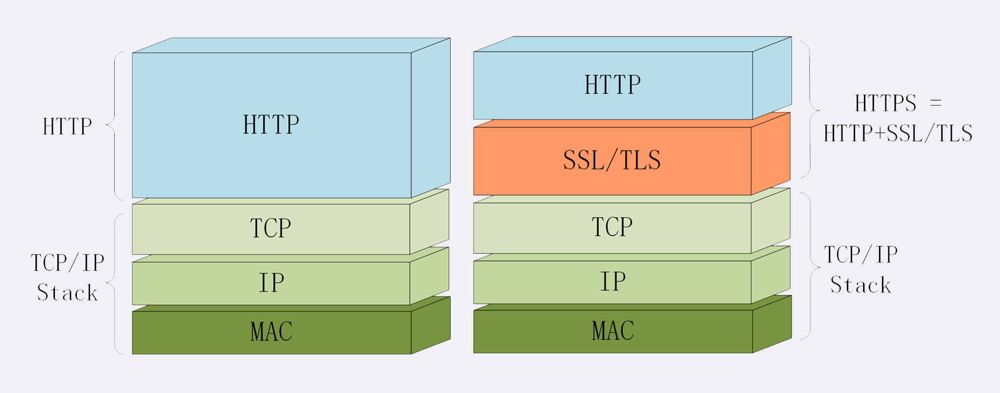
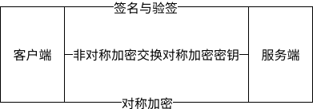
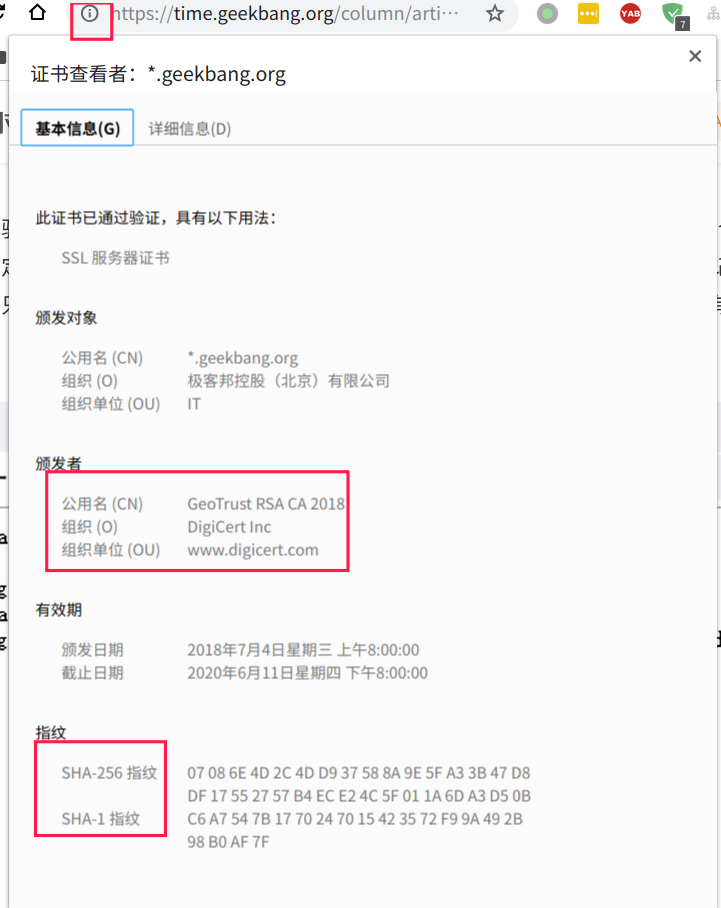

# HTTP协议学习笔记(六) HTTPS协议

## 0X00 梗概

经过前面五节的学习，HTTP协议的基本知识点已经讲解完毕了，这里总结一下HTTP协议的特性：

- 简单易扩展
- 无状态：可通过Cookie技术解决
- 明文传输
- 无法验证通信双方身份真实性
- 无法校验数据完整性

最后三个特性导致HTTP协议无法建立安全可信的通道，传输高度保密的数据。为了实现安全可信的通信，HTTPS协议诞生了。

## 0X01 什么样的通信才是安全的？

一个安全的通信必须具备如下特性：

- 机密性：加密传输的数据。
- 完整性：确保数据在传输过程中不被篡改。
- 身份认证：确认对方身份，确保数据发送给目标。
- 不可否认：不能否认之前的行为。

## 0X02 HTTPS协议如何实现安全的通信？

HTTPS协议在HTTP协议的基础上，将TCP/IP协议替换为SSL/TLS协议，其结构为：

HTTPS的安全部分由SSL/TLS协议负责。

## 0X03 如何实现机密性？

TLS协议提供了很多密码学前沿技术，很多应用软件采用OpenSSL来实现TLS功能。

针对机密性，最常见的手段是加密，即使用**密钥**将**明文数据**加密为**密文数据**，**密文数据**传递给对端后，再将**密文数据**解密为**明文数据**。加密手段可分为两大类：

- **对称加密**
- **非对错加密**

对称加密中加解密的密钥相同。常见的对称加密算法有AES和ChaCha20。对称加密中有一个分组模式概念，能使用固定长度的密钥加密任意长度的明文，常见的分组模式有GCM、CCM和Poly1305。

非对称加密中加解密的密钥分公钥和私钥。公钥对外公布，私钥自己保留，具备单向性：私钥加密，只能由公钥才能解密；反之相同。常见的非对称加密算法有RSA算法(基于整数分解)和ECC算法(基于椭圆曲线离散对数)。

对称加密的优点是**加解密速度快**，缺点是**无法安全交换密钥**。非对称加密的优点是**解决了密钥交换问题**，缺点是**加解密速度非常慢**。TLS中采用了**混合加密**的方式：先采用非对称加密交换密钥，然后采用对称加密传输数据。

## 0X04 如何实现完整性？

确保了通信的机密性后，还必须确保加密的数据在传输过程中不被篡改。

实现完整性的主要手段是摘要算法(散列函数)。摘要算法可以为明文生成一个独一无二的摘要字符串。摘要算法是单向的，因此无法通过摘要字符串逆推出明文。通过将明文和摘要一起加密，解密后，通过对比明文的新摘和旧摘要，判断数据是否被篡改。

常见的摘要算法是SHA-1、SHA-2。

## 0X05 如何实现身份认证和不可否认？

通信具备机密性和完整性，传输过程中的安全性可以保证，但是无法保证对端是否是可信的，如果黑客伪装成网站与你通信，可以窃取你的信息。

实现身份认证的手段是数字签名。数字签名同时实现了身份认证和不可否认两大功能，数字签名采用你的私钥加密原文的摘要(签名)，拥有对应公钥的人来解密摘要(验签)，再验证原文的完整性，这样就能确保消息的确是你发送的。

通信的双方通过交换公钥，使用签名和验签来确保消息的真实性。

因此一个完整的流程是：

## 0X06 如何确保公钥是可信的？

建立一个安全可信的传输通道的前提是**交换公钥**，那么如何防止伪造公钥呢？解决这个问题的手段是引入公认可信的第三方(**CA**)，从他们开始建立公钥的信任链。**CA**对公钥进行认证后，生成**数字证书**，小**CA**让大**CA**认证，从而形成了一条证书的信任链，链条的最后是**根证书**，各大操作系统和浏览器都内置了**根证书**，因此验证到**根证书**即可确保公钥可信。通过浏览器可以查看网站的证书信息。

证书体系也是存在弱点的，如果**CA**颁发了错误的证书或被黑客攻击，则会导致证书出问题。针对这两种情况有相应的解决方案：

- 颁发错误证书：通过CRL(证书吊销列表)或OCSP(在线证书状态)及时废止错误证书。
- **CA**机构被攻击：操作系统或浏览器会撤销**CA**的信任。

我们通过浏览器访问服务器时，服务器会返回证书链。假设使用的是三级证书体系(Root CA=> 一级 CA=> 二级 CA)。浏览器的证书验证流程如下：

- 使用内置根证书公钥解析根证书，获得一级证书公钥，并进行摘要验签。
- 使用一级证书公钥解析一级证书，获得二级证书公钥，并进行摘要验签。
- 使用二级证书公钥解析二级证书，获得服务器的公钥，并进行摘要验签。