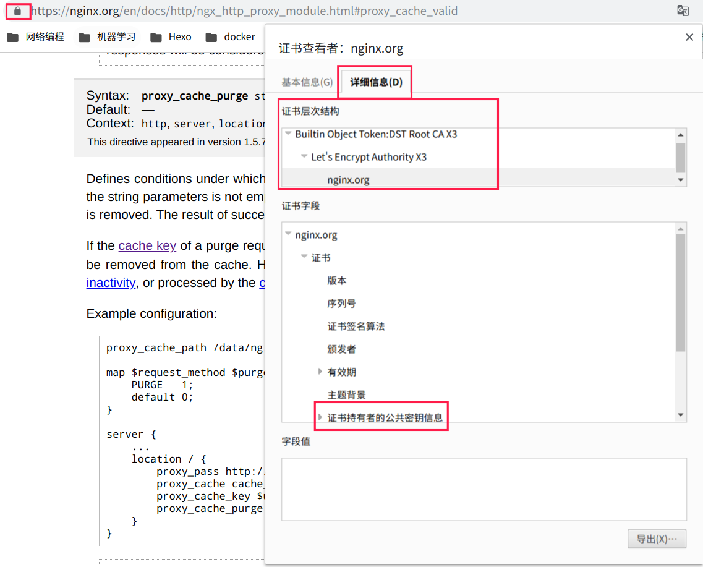
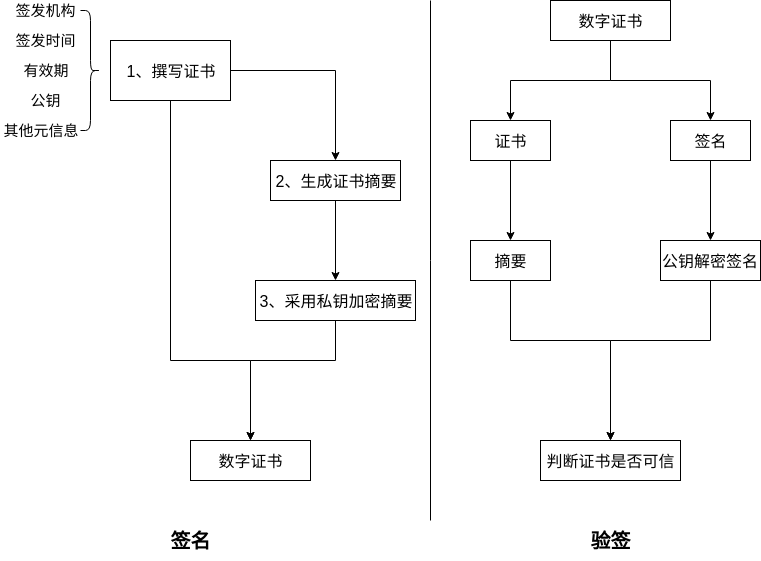
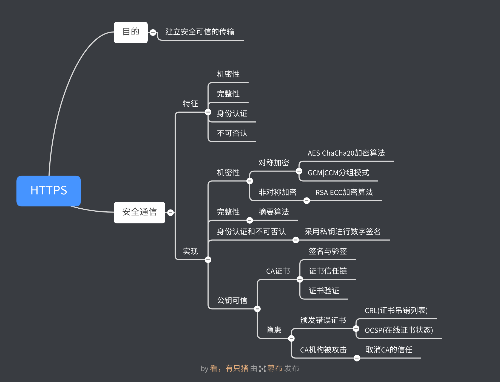

# HTTP协议学习笔记(六) HTTPS理论

## 0X00 梗概

经过前面几节的学习，HTTP协议的基本知识点已讲解完毕，这里总结一下HTTP协议的特性：

- 简单易扩展
- 无状态
- 明文传输
- 无法验证通信双方身份真实性
- 无法校验数据完整性

最后三个特性导致HTTP协议无法建立安全的通信。为了解决这个问题，HTTPS协议诞生了。

## 0X01 安全通信具备的特性？

一个安全的通信必须具备如下特性：

- 机密性：加密传输的数据。
- 完整性：确保数据在传输过程中不被篡改。
- 身份认证：确认对方身份，确保数据发送给正确目标。
- 不可否认：不能否认之前的行为。

## 0X02 HTTPS协议如何实现安全通信？

HTTPS协议在HTTP协议与TCP/IP协议之间加入了SSL/TLS协议，其协议名为`https`，默认端口为`443`。

TLS协议负责实现安全通信。TLS协议有两种，分别为TLS 1.2和TLS1.3。

## 0X03 如何实现机密性？

针对机密性，最常见的手段是加密，即使用**密钥**将**明文数据**加密为**密文数据**，**密文数据**传递给对端，对端再将**密文数据**解密为**明文数据**。加密手段可分为两大类：

- **对称加密**
- **非对称加密**

对称加密中加解密的密钥相同。常见的对称加密算法有AES和ChaCha20。对称加密中有一个分组模式概念，能使用固定长度的密钥加密任意长度的明文，常见的分组模式有GCM、CCM和Poly1305。

非对称加密中加解密的密钥分公钥和私钥，公钥对外公布，私钥自己保留。非对称加密具备单向性：私钥加密，只能由公钥才能解密；反之相同。常见的非对称加密算法有RSA算法(基于整数分解)和ECC算法(基于椭圆曲线)。

对称加密的优点是**加解密速度快**，缺点是**交换密钥时无法保障安全**。非对称加密的优点是**解决了密钥交换问题**，缺点是**加解密速度非常慢**。基于二者的优缺点，TLS采用**混合加密**的方式：先使用非对称加密交换对称加密密钥，然后通过对称加密传输数据。

## 0X04 如何实现完整性？

完整性的目标是保障加密的数据在传输过程中不被篡改。

针对完整性，主要实现手段是摘要算法(散列函数)。摘要算法可以为明文生成一个独一无二的摘要字符串。由于摘要算法具备单向性，因此无法通过摘要字符串逆推出明文。明文将和摘要一起被加密，通过对比解密后明文的新、旧摘要，判断数据是否被篡改。

常见的摘要算法有SHA-1、SHA-2。

## 0X05 如何实现身份认证和不可否认？

通信具备机密性和完整性，可以保证传输过程中的安全性，但是无法保证对端是可信的。

实现身份认证的手段是数字签名。数字签名同时实现了身份认证和不可否认两大功能。数字签名采用私钥加密原文的摘要(签名)，对端使用公钥解密摘要(验签)，验证原文的完整性。通过签名与验签两个操作，可以确保对端是可信的。

## 0X06 如何确保公钥是可信的？

通过四个特性的实现，可以发现，建立安全可信的传输的前提是**交换公钥**。那么如何保证公钥的可信性呢？解决这个问题的手段是引入公认可信的**CA**，由**CA**机构负责颁发证书。

通过浏览器可以查看CA机构为网站颁发的数字证书。

**CA**对公钥进行签名，生成**数字证书**，其流程是：

## 0X07 CA如何证明自己？

通过信任链来实现**CA**的可信，**大CA**负责认证**小CA**，形成了一条证书的信任链。

链条的最后是**根CA**，**根CA**只能通过自签名证明自己。各大操作系统和浏览器内置了**根证书**，验证到**根证书**即可确保证书是可信，证书中包含的公钥也是可信的。

证书体系也存在弱点：如果**CA**颁发了错误的证书或被黑客攻击，会导致证书出问题。针对这两种情况有相应的解决方案：

- 颁发错误证书：通过CRL(证书吊销列表)或OCSP(在线证书状态)及时废止错误证书。
- **CA**机构被攻击：操作系统或浏览器会撤销对**CA**的信任。

## 0X08 CA证书是如何验证的？

访问一个网站时，服务器将给浏览器返回一个不包含根证书的证书链，假设该证书链如下：一级 CA证书 => 二级 CA证书 => 服务器证书。浏览器的证书验证流程如下：

- 通过证书的签发机构，从下往上找到内置的根证书，如果根证书存在，则证明该证书合法。
- 通过根证书的公钥，解析一级CA的证书，获得一级CA公钥和摘要验签。
- 使用一级CA公钥解析二级CA的证书，获得二级CA公钥和摘要验签。
- 使用二级CA公钥解析服务器的证书，获得服务器公钥和摘要验签。

## 0X09 总结

