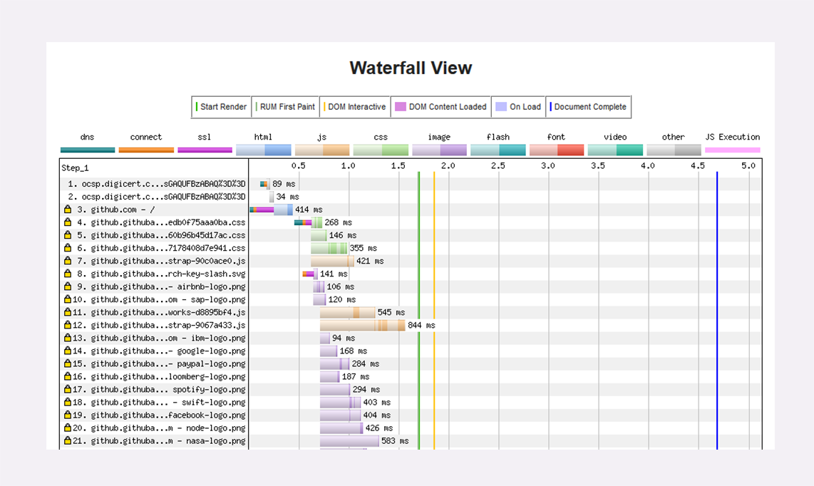
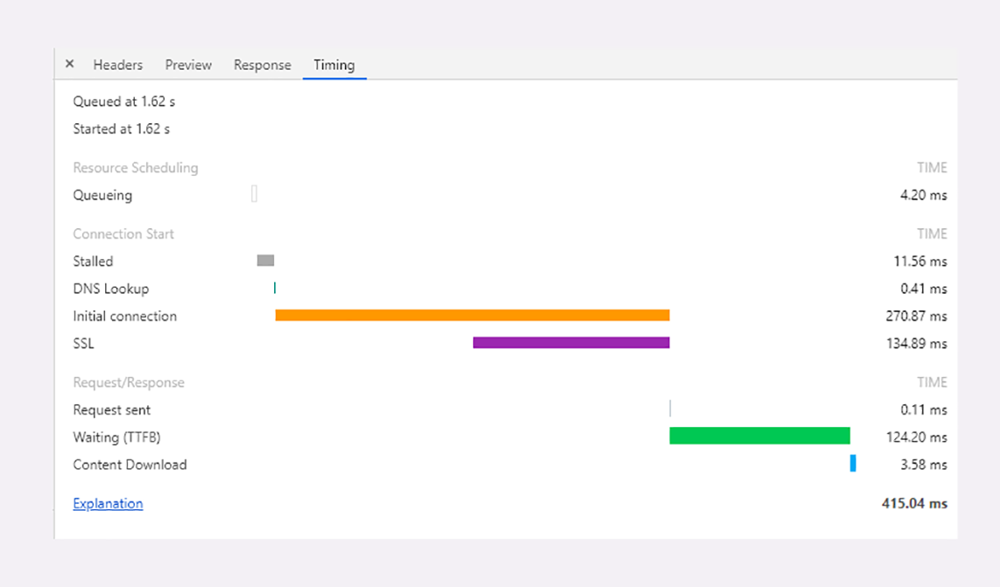
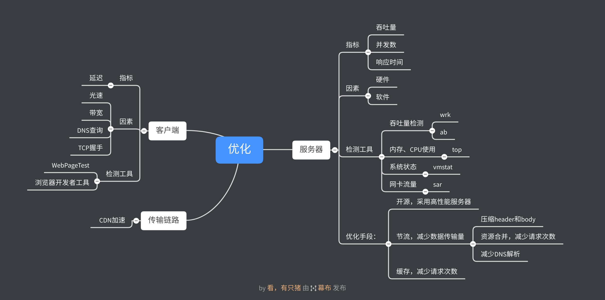

# HTTP协议学习笔记(十)—HTTP性能优化

## 0X00 梗概

HTTP传输过程中有三个角色：

- 客户端
- 服务器
- 传输链路

因此性能优化将着手于这三部分。

## 0X01 服务器

服务器端优化的方向是充分利用系统资源，提供服务器吞吐率和并发数，降低响应时间。因此我们需要去观察服务器的性能和服务器系统资源的使用情况。

性能对服务器来说，是以最快速的速度、处理尽可能多的请求。衡量服务器性能的主要指标有三个：

- 吞吐量：每秒的请求次数。
- 并发数：同时支持的客户端数量。
- 响应时间：处理一个请求的耗时。

这三个指标可以使用性能测试工具`ab`(Apache Bench)或`wrk`

系统资源方面可以使用Linux自带工具。

- 内存和CPU使用：`top`
- 系统状态：`vmstat`
- 网卡流量：`sar`

服务器的优化手段主要有三个手段：

- 开源：充分利用硬件，提高服务器性能。
- 节流：减少数据传输量。
- 缓存：减少请求次数。

开源方面主要采用高性能Web服务器，如Nginx和OpenResty。通过Nginx的反向代理功能，实现动静分离，将动态请求反向代理到业务逻辑服务器(Java、Python)，静态资源请求由Nginx进行处理。Nginx提供了很多调优参数，如`keepalive`、`tcp fast open`、`reuseport`，可以减少握手延迟。

节流方面有四方面可以进行优化：

- 压缩header：主要采用`domain`和`path`限制`Cookie`的使用。
- 压缩body：针对不同的内容选择合适的压缩方式(选择适当压缩比)，如文本采用`gzip`、图片剔除无效元数据(地点、时间等)后采用高压缩率格式(有损JPEG，无损Webp)。
- 减少请求次数：采用资源合并，减少请求次数。
- 减少DNS解析：减少域名和重定向使用。

缓存方面主要是利用好缓存策略，在客户端本地、CDN和Web服务器中设置缓存，尽量减少请求的次数和响应时间。

## 0X02 客户端

客户端最看重的是延迟(等待响应到来所花费的时间)。延迟由几点原因导致：

- 光速：距离过远，必然延迟大。
- 带宽：传输中各个节点的带宽决定了同时能传输的数据量。
- DNS查询：没有域名缓存时，需要发起请求从DNS获取。
- TCP握手：由距离和带宽所决定(带宽小，网络拥塞时会出现丢包重传)。

客户端延迟可以采用`WebPageTest`进行测试。

通过浏览器的`开发者工具->网络`也可以查看客户端加载资源耗时时间。

## 0X03 传输链路

传输链路主要是通过CDN所建立的专用网络，以最快的速度传输数据。

## 0X04 采用HTTP/2

直接采用HTTP/2是最简单的优化方法。HTTP/2通过头部压缩减少了Header的尺寸、二进制帧和多路复用解决了应用层的队头阻塞问题，服务器推送减少了客户端的请求次数，大幅度提升了HTTP传输效率。升级到HTTP/2中需要取消HTTP/1中的一些优化手段，如资源合并、域名分片，让资源的粒度尽可能小，才能更好发挥缓存的作用。

## 0X05 总结

## 0X06 参考

- HTTP性能优化面面观（上）：https://time.geekbang.org/column/article/126374
- HTTP性能优化面面观（下）https://time.geekbang.org/column/article/127808

