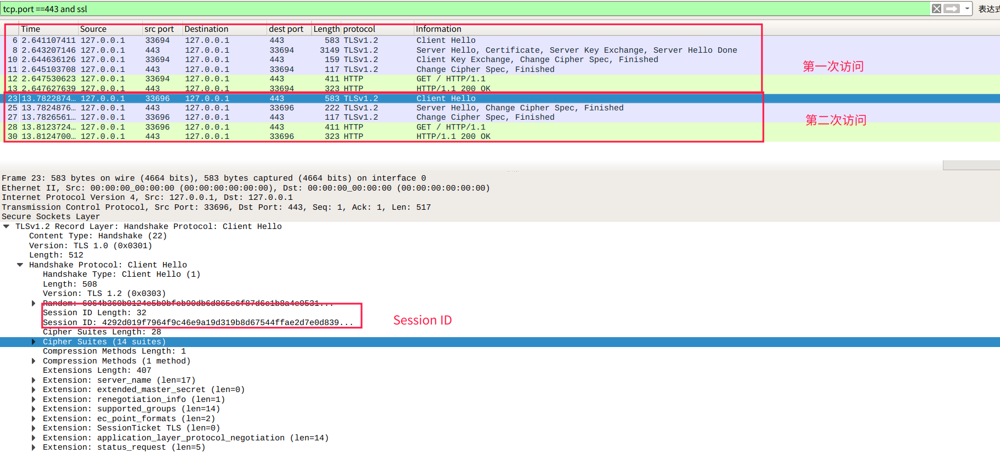
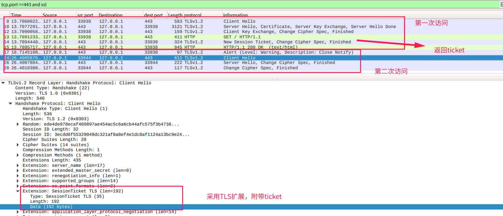
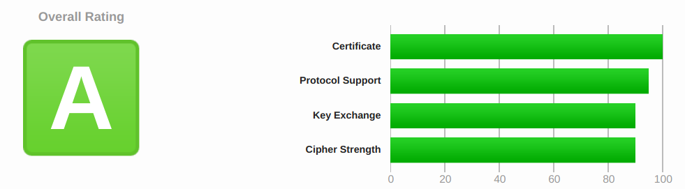
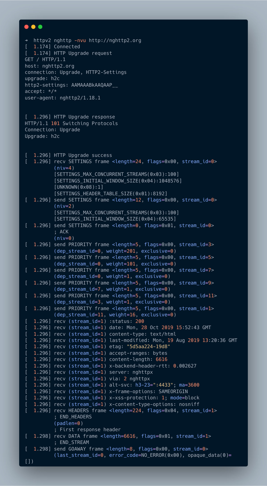

# HTTP协议学习笔记(十一) 实验

## 0X00 梗概

在这一节中，我们将完成以下的实现：

- 安装`Nginx`
- 实践`HTTPS`
- 实践`Session ID`
- 实践`Session Ticket`
- 实践`OCSP Stapling`
- 实践`TLS 1.3`
- 实践`HTTP/2`

## 0X01 准备

我的测试环境是`Deepin`，如果你的测试环境是`Ubuntu`或`Centos`，请使用相关命令安装依赖`pcre`、`zlib`和`openssl`。

```bash
# 下载nginx源码：https://nginx.org/en/download.html
➜  ~ mkdir /home/fangjie/Desktop/network_lib
➜  ~ cd /home/fangjie/Desktop/network_lib
➜  network_lib wget https://nginx.org/download/nginx-1.17.3.tar.gz
➜  network_lib tar -zxvf nginx-1.17.3.tar.gz

# 安装依赖
➜  network_lib sudo apt install libpcre3 libpcre3-dev
➜  network_lib sudo apt install zlib1g zlib1g-dev
➜  network_lib sudo apt install openssl

# 下载openssl 1.1.1 tls 1.3需要
➜  network_lib wget -c  https://github.com/openssl/openssl/archive/OpenSSL_1_1_1.tar.gz
➜  network_lib tar -zxvf OpenSSL_1_1_1.tar.gz
➜  network_lib mv openssl-OpenSSL_1_1_1 openssl

# 安装http2测试工具nghttp2
➜  network_lib sudo apt install nghttp2

# 存储你的域名证书信息，我的域名证书是从阿里云购买的
➜  network_lib mkdir cert

# 修改hosts，将127.0.0.1映射到域名上，便于本地测试
# 修改内容如下
➜  network_lib cat /etc/hosts
127.0.0.1	localhost
127.0.1.1   fangjie-PC
127.0.0.1   fangjie.site
127.0.0.1   www.fangjie.site

# 准备好后，实验环境目录结构
➜  network_lib mkdir nginx_lib
➜  network_lib tree -L 1
.
├── cert
├── nginx-1.17.3
├── nginx-1.17.3.tar.gz
├── nginx_lib
├── openssl
└── openssl-OpenSSL_1_1_1.tar.gz
```

## 0X02 搭建HTTPS

```bash
➜  network_lib cd nginx-1.17.3
# 编译
➜  nginx-1.17.3 ./configure --prefix=/home/fangjie/Desktop/network_lib/nginx_lib/https --with-http_ssl_module
# 安装
➜  nginx-1.17.3 make && make install
➜  nginx-1.17.3 cd ../nginx_lib/https
# 拷贝证书
➜  https sudo cp -r ../../cert ./

# 编辑配置文件 conf/nginx.conf
worker_processes  1;

events {
    worker_connections  1024;
}

http {
    include       mime.types;
    default_type  application/octet-stream;

    sendfile        on;
    keepalive_timeout  65;

    server {
       listen 443 ssl;
       server_name fangjie.site www.fangjie.site;
       ssl_certificate ../cert/www.fangjie.site.pem;
       ssl_certificate_key ../cert/www.fangjie.site.key;

        location / {
            root   html;
            index  index.html index.htm;
        }

        error_page   500 502 503 504  /50x.html;
        location = /50x.html {
            root   html;
        }
    }
}
# 重启nginx
➜  https sudo pkill nginx
➜  https sudo sbin/nginx
# 验证
➜  sbin curl https://fangjie.site
<!DOCTYPE html>
<html>
<head>
<title>Welcome to nginx!</title>
....
```

## 0X03 Session ID

```bash
# 编辑配置文件 conf/nginx.conf
worker_processes  1;

events {
	worker_connections  1024;
}

http {
    include       mime.types;
    default_type  application/octet-stream;

    sendfile        on;
    keepalive_timeout  5;

    server {
        listen 443 ssl;
        server_name fangjie.site www.fangjie.site;
        ssl_certificate ../cert/www.fangjie.site.pem;
        ssl_certificate_key ../cert/www.fangjie.site.key;
        # 打开session缓存,时间5分钟
        ssl_session_cache shared:SSL:5m;
        ssl_session_timeout 5m;
        # 关闭session ticket 避免干扰
        ssl_session_tickets off;
        location / {
            #root   html;
            #index  index.html index.htm;
            # 返回其Session ID
            return  200 "$ssl_session_id,$ssl_session_reused";
        }

        error_page   500 502 503 504  /50x.html;
        location = /50x.html {
        root   html;
        }
    }
}
# 重启nginx
➜  https sudo sbin/nginx -s reload
# 验证:启动多个窗口，先后访问https://fangjie.site，并刷新查看显示和抓包结果
```

通过抓包可以看到，第二次没有经过`Client Key Exchange`直接切换到对称加密中。对比两次访问的`Client Hello`，你会发现`Session ID`是相同的，也和下载的两个文件中的`Session ID`相同。



## 0X04 Session Ticket

```nginx
# 生成ticket加密秘钥
➜  https openssl rand 80 > cert/ticket.key
# 编辑配置文件 conf/nginx.conf
worker_processes  1;

events {
    worker_connections  1024;
}

http {
    include       mime.types;
    default_type  application/octet-stream;

    sendfile        on;
    keepalive_timeout  65;

    server {
        listen 443 ssl;
        server_name fangjie.site www.fangjie.site;
        ssl_certificate /usr/local/nginx/cert/www.fangjie.site.pem;
        ssl_certificate_key /usr/local/nginx/cert/www.fangjie.site.key;
        # 关闭Session缓存
	    ssl_session_cache off;   
        ssl_session_tickets on;
        ssl_session_ticket_key /usr/local/nginx/cert/ticket.key;      
        location / {
            root   html;
            index  index.html index.htm;
    	}

        error_page   500 502 503 504  /50x.html;
        location = /50x.html {
            root   html;
        }
    }
}
# 重启nginx
➜  https sudo sbin/nginx -s reload
# 验证:启动多个窗口，先后访问https://fangjie.site，并刷新查看显示和抓包结果
```

通过抓包可以看到，第一次访问后，服务器通过`New Session Ticket`传递加密后的ticket给客户端。客户端第二次访问时，使用`Client Hello`传递Ticket给服务器验证。



## 0X05 OCSP Stapling

```bash
# 编辑配置文件 conf/nginx.conf
worker_processes  1;

events {
    worker_connections  1024;
}

http {
    include       mime.types;
    default_type  application/octet-stream;

    sendfile        on;
    keepalive_timeout  65;

    server {
        listen 443 ssl;
        server_name fangjie.site www.fangjie.site;
        ssl_certificate ../cert/www.fangjie.site.pem;
        ssl_certificate_key ../cert/www.fangjie.site.key;
        # 关闭Session缓存
	    ssl_session_cache off;   
        ssl_session_tickets on;
        ssl_session_ticket_key ../cert/ticket.key;      
        ssl_stapling on;# 打开OCSP Stapling
        location / {
            root   html;
            index  index.html index.htm;
    	}

        error_page   500 502 503 504  /50x.html;
        location = /50x.html {
            root   html;
        }
    }
}
# 重启nginx
➜  https sudo sbin/nginx -s reload
# 验证
➜  https openssl s_client -connect fangjie.site:443 -status -tlsextdebug < /dev/null 2>&1 | grep -i "OCSP response"
OCSP response: no response sent
# 第一次访问时会有no response sent，因为服务器还没有获取该信息
➜  https openssl s_client -connect fangjie.site:443 -status -tlsextdebug < /dev/null 2>&1 | grep -i "OCSP response"
OCSP response: 
OCSP Response Data:
    OCSP Response Status: successful (0x0)
    Response Type: Basic OCSP Response
# 第二次访问时，Basic OCSP Response
```

## 0X06 TLS 1.3

```bash
# 编译
➜  network_lib cd nginx-1.17.3
➜  nginx-1.17.3 ./configure --prefix=/home/fangjie/Desktop/network_lib/nginx_lib/tls13 --with-openssl=../openssl --with-openssl-opt='enable-tls1_3 enable-weak-ssl-ciphers' --with-http_ssl_module
➜  nginx-1.17.3 sudo make && sudo make install
➜  nginx-1.17.3 cd ../nginx_lib/tls13
# 拷贝证书
➜  tls13 sudo cp -r ../../cert ./
# 编辑nginx.conf
worker_processes  1;
  
events {
worker_connections  1024;
}
  
http {
    include       mime.types;
    default_type  application/octet-stream;

    sendfile        on;
    keepalive_timeout  65;

    server {
        listen 443 ssl;
        server_name fangjie.site www.fangjie.site;
        ssl_certificate ../cert/www.fangjie.site.pem;
        ssl_certificate_key ../cert/www.fangjie.site.key;
		# 支持0-RTT 测试的前提是你的浏览器支持0RTT
		# 通过https://ssl.haka.se/检测
        ssl_early_data on;
        ssl_ciphers TLS13-AES-256-GCM-SHA384:TLS13-CHACHA20-POLY1305-SHA256:TLS13-AES-128-GCM-SHA256:TLS13-AES-128-CCM-8-SHA256:TLS13-AES-128-CCM-SHA256:EECDH+CHACHA20:EECDH+CHACHA20-draft:EECDH+ECDSA+AES128:EECDH+aRSA+AES128:RSA+AES128:EECDH+ECDSA+AES256:EECDH+aRSA+AES256:RSA+AES256:!MD5;
        ssl_protocols               TLSv1 TLSv1.1 TLSv1.2 TLSv1.3;
        ssl_ecdh_curve              X25519:P-256:P-384:P-521;
        ssl_prefer_server_ciphers   on;

        location / {
        proxy_set_header Early-Data $ssl_early_data;
            root   html;
            index  index.html index.htm;
        }
    }
}
# 重启nginx
➜  tls13 sudo sbin/nginx -s reload
```

使用https://www.ssllabs.com/来测试我自己的网站的得分。



## 0X07 HTTP/2实验

```bash
➜  network_lib cd nginx-1.17.3
# 编译
# prefix 指定安装目录 --with指定需要启动的模块
➜  nginx-1.17.3 ./configure --prefix=/home/fangjie/Desktop/network_lib/nginx_lib/httpv2 --with-http_ssl_module --with-http_v2_module

# 安装
➜  nginx-1.17.3 make && make install
➜  nginx-1.17.3 cd ../nginx_lib/httpv2

# 拷贝证书
➜  httpv2 sudo cp -r /home/fangjie/Desktop/network_lib/cert ./cert
➜  httpv2 tree -L 1
.
├── cert
├── conf
├── html
├── logs
└── sbin

# 编写配置文件conf/nginx.conf
worker_processes  1;
  
events {
worker_connections  1024;
}
  
http {
    include       mime.types;
    default_type  application/octet-stream;

    sendfile        on;
    keepalive_timeout  65;

    server {
        server_name fangjie.site www.fangjie.site;
        
        # 打开h2c，只支持直接发送h2c请求，不支持从http1.1升级到http2
        listen 80 http2;
        
        # 使用h2
        # listen 443 ssl http2;
        # ssl_certificate ../cert/www.fangjie.site.pem;
        # ssl_certificate_key ../cert/www.fangjie.site.key;

        location / {
            return 200 "ssl_cipher:$ssl_cipher
ssl_protocol:$ssl_protocol
http version:$server_protocol
http2 protocol:$http2
";
        }
    }
}

# 重新加载配置
➜  httpv2 sudo sbin/nginx -s reload
```

`h2`中，通过TSL的ALPN协商使用的协议版本。


其`HTTP/2`协议层通信流程为：


`h2c`中，采用`HTTP/2`直接连接通信时，`HTTP/2`协议通信流程为：


`h2c`中，采用`HTTP/1.1`升级到`HTTP/2`时，`HTTP/2`协议通信流程为：



