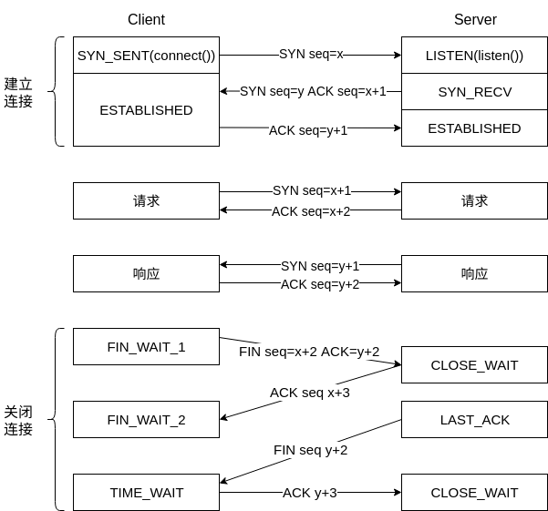

# HTTP协议学习笔记(四)  连接管理

## 0X00 长、短连接

### 短连接

HTTP协议底层的数据传输基于TCP/IP，每次发送请求前需要先与服务器建立连接，收到响应后立即关闭连接。**短连接**指每次发送请求都要建立、关闭一个TCP连接，TCP 3次握手需要1.5个RTT(往返时延：发出数据开始到收到对端确认)；4次断开需要2个RTT；请求和响应需要2个RTT。

短连接中有近$\frac{2}{5.5} \approx 55\%$的时间用于连接管理，传输效率低。

### 长连接

长连接则采用建立连接后默认不断开，只有主动发送断开连接请求才会断开。HTTP 1.0中需要使用字段`Connection:keep-alive`建立长连接，使用`Connection:close`关闭长连接，HTTP 1.1默认采用长连接。

长连接的缺陷在于大量空闲的长连接会很快耗尽服务器资源，导致无法为真正有需要的用户服务(DDoS)。为避免这种情况，需要让长连接及时断开，`nginx`通过`keepalive_timeout`和`keepalive_requests`设置长连接保持时间和设置长连接的请求最大数量。

### 队头阻塞

HTTP的请求-应答模型导致发送报文后必须等待其响应，因此会形成了一个先进先出的队列，如果队首的请求阻塞，则会导致后面的请求无法处理。解决方案：

- 并发连接：建立多个连接，通常为6~8，无限制的话会导致服务器资源消耗过快。
- 域名分片：设置多个子域名，子域名指向目标服务器，这样可以突破客户端并发连接数的限制。

