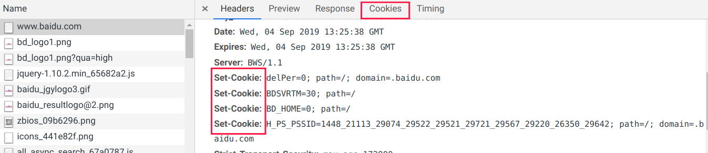
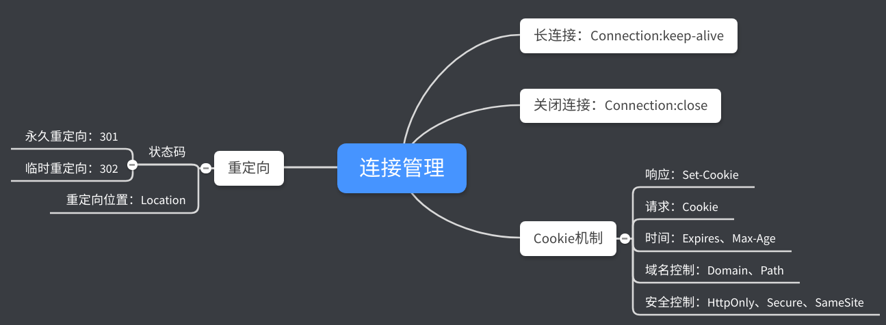

# HTTP协议学习笔记(四)  连接管理

这一章记录有关HTTP协议中连接管理的相关知识点，主要有长短连接、Cookie机制和重定向。

## 0X00 短连接

HTTP协议底层的数据传输基于TCP/IP，每次发送请求前需要先与服务器建立连接，收到响应后立即关闭连接。**短连接**指每次发送请求都要建立、关闭一个TCP连接，TCP 3次握手需要1.5个RTT(往返时延：发出数据开始到收到对端确认)；4次断开需要2个RTT；请求和响应需要2个RTT。

短连接中有近$\frac{2}{5.5} \approx 55\%$的时间用于连接管理，传输效率低。

## 0X01长连接

长连接则采用建立连接后默认不断开，只有主动发送断开连接请求才会断开。HTTP 1.0中需要使用字段`Connection:keep-alive`建立长连接，使用`Connection:close`关闭长连接，HTTP 1.1默认采用长连接。

长连接的缺陷在于大量空闲的长连接会很快耗尽服务器资源，导致无法为真正有需要的用户服务(DDoS)。为避免这种情况，需要让长连接及时断开，`nginx`通过`keepalive_timeout`和`keepalive_requests`设置长连接保持时间和设置长连接的请求最大数量。

## 0X02 队头阻塞

HTTP的请求-应答模型导致发送报文后必须等待其响应，因此会形成了一个先进先出的队列，如果队首的请求阻塞，则会导致后面的请求无法处理。解决方案：

- 并发连接：建立多个连接，通常为6~8，无限制的话会导致服务器资源消耗过快。
- 域名分片：设置多个子域名，子域名指向目标服务器，这样可以突破客户端并发连接数的限制。

## 0X03 Cookie机制

HTTP协议是无状态的，这是一把双刃剑。优点是简单、资源占用少且服务器没有状态差异，很容易组成集群，而其缺点是无法支持需要记录状态的事务操作(想象一下使用淘宝时，每个操作都需要登录)。

HTTP协议通过扩展添加了Cookie解决了这个问题。其核心是客户端访问时，服务器为客户端生成一份定制信息，然后通过响应头字段`Set-Cookie`传递给客户端，客户端下次通过请求字段`Cookie`提交这个信息，服务器根据这个信息获取用户之前的状态。

通过浏览器抓包可以看到Cookie的相关属性，Cookie的格式为KV结构，多个值有`;`隔开。

Cookie中有一些常用属性：

- `Expires`：过期时间，采用绝对时间。
- `Max-Age`：过期时间，采用相对时间，单位是秒，绝对时间为收到响应+`Max-Age`。`Max-Age`优先级更高。
- `Domain`：Cookie所属域名，浏览器根据URI中的域名和`Domain`对比，判断是否在请求中发送Cookie。
- `Path`：Cookie所属的路径，用于限制Cookie只向域名的特定路径发送，通常为`/`或省略，域名下任意路径都允许使用。为了减少发送的数据量，建议还是限制路径。
- `HttpOnly`：禁止其他方式访问，只允许浏览器通过HTTP协议发送，杜绝脚本攻击。
- `SameSite`：防止跨站请求伪造。`SameSite=Strict`不允许Cookie跟随跳转跨站发送。`SameSite=Lax`，允许GET、HEAD方法，不允许POST跨站发送。
- `Secure`：该Cookie只能通过HTTPS协议加密传输。

Cookie协议是采用明文传输，如果有人截获Cookie，则可以冒充用户，这也是一些爬虫的原理，建立Cookie池，模拟用户访问，因此Cookie也需要一些安全手段配合，比较常见的是通过HTTPS加密传输，避免中间人拦截。

## 0X04 重定向

重定向是由服务器所控制，要求客户端去访问新的URI。服务器会向客户端发送300状态码，客户端收到后，根据响应的`Location`字段，访问执行的URI。

常用重定向状态码有301/302两种：

- `301`：Moved Permanently，永久重定向，资源已经分配新URI，客户端请求新的URI。
- `302`：Found，临时重定向。

`301`状态码强调永久改变，主要用于当网站的目录结构发生改变，用户保存的原URI已不可用，直接拒绝访问会影响用户使用，可以通过`301`状态码要求客户端更新URI。

`302`状态码强调临时改变，常用于系统维护或服务降级，让用户过段时间再访问。

重定向也存在两个问题：

- 性能损耗：需要多访问一次。
- 可能出现循环跳转：`A==>B==>C==>A`。

## 0X05 总结

## 0X06 参考资料

极客时间课程《透视HTTP协议》

MDN Web docs：https://developer.mozilla.org/zh-CN/docs/Web/HTTP/Headers

------

