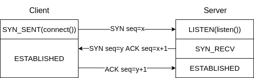

# TCP

## 设计原理

TCP协议是一个面向数据流、全双工的协议，其提供端到端的可靠连接。

- 数据流：通过为每个包添加一个序列号，实现包的有序性，因此传输过来的数据如同一个流一样，是连续且有序的。
- 全双工：通过交换两端包的起始序列号号，建立各自的数据流。
- 可靠连接：通过每个数据发送发送一个`ACK`响应包，其附带的`seq`为期待的下一个期待数据包的序列号。

## TCP数据负载大小

数据链路层中一个帧的大小为1522字节，头部为22字节，数据负载最大为1500个字节，因此IP数据包的大小最大为1500字节。IP数据包的头部至少需要20字节，其数据负载最大为1480字节。TCP数据包的头部至少需要20字节，其数据负载最大为1460字节，但是IP数据包和TCP数据包头部会包含其他信息，数据负载通常只有1400字节。

### 

### 建立连接

建立全双工通信时，需要进行四次通信(两次请求+响应)，服务器端的请求和对客户端的响应可以合并在一次通信中发送，因此最少需要3次握手。

- TCP建立连接的目的是
  - 分配资源
  - 初始化包序列号(`ISN`)。
- 准备：Server通过`listen()`监听端口，进入`LISTEN`状态。
- 第一次握手：Client发送`SYN seq=x`，Client进入`SYN_SENT`状态。
- 第二次握手：Server收到包后，发送`SYN seq=y`，并附上`ACK seq=x+1 `，CServer进入`SYN_RECV`状态。
- 第三次握手：Client收到包后，发送`ACK seq=y+1`。

### 疑问

- 包初始序列号能否固定？

  如果`ISN`固定，当出现断线重连后，发送的新包的序号会与之前冲突，`RFC793`建议`ISN`号由一个32位计数器控制，每`4μs`会+1，但是会出现攻击者可猜测`ISN`，因此实现时，是一个随机值。

- 初始化连接时，Client发送`SYN`后，Client挂了如何处理？

  Server发送了`SYN-ACK`后，没有收到Client的`ACK`确认，连接处于未成功也未失败状态，如果没有一个超时机制，会导致大量连接将Server的`SYN`队列耗尽，阻塞正常连接。

  Linux下默认进行5次重发`SYN-ACK`，重试时间间隔为：`1S`、`2S`、`4S`、`8S`、`16S`，总耗时为：1S+2S+4S+8S+16S+32S(第五次发出后，需要等待32s，才能确认失败)=63S。

  `SYN`超时默认需要63秒，因此攻击者可以通过短时间发送大量`SYN`给Server，耗尽Server的`SYN`队列，达到阻塞正常连接的目的(`SYN flood攻击`)。应对方案(`/proc/sys/net/ipv4/`)：

  - `tcp_syncookies`：打开`SYN Cookie`，避免部分`SYN`攻击，建议先关闭。
  - `tcp_synack_retries`：`SYN`重试次数。
  - `tcp_max_syn_backlog`：`SYN`队列大小。
  - `tcp_abort_on_overflow`：第三次握手，队列满了，导致Server丢弃了Client发送的`ACK`。

## 数据传输流程

## 断开连接

### 疑问

## 参考

- Linux TCP系统参数配置：https://linux.cn/article-1394-1.html