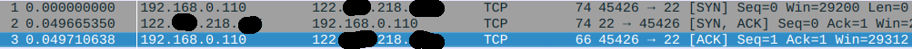
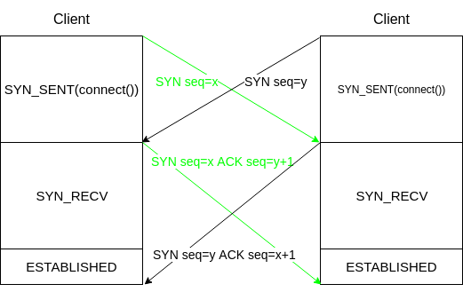

# TCP协议学习—连接建立

## 连接建立

TCP连接是一个全双工连接，因此需要两端各自建立连接。`Cient`和`Server`之间至少需要进行四次通信(两次请求+响应)，`Server`的请求和对`Client`的响应可以合并在一次通信中发送，因此最少需要3次通信。

- TCP建立连接的目的是
  - 分配资源
  - 初始化包序列号(`ISN`)。
- 具体流程
  - 第一次握手：Client发送`SYN`包，告知Server，源端口和初始序列号，Client进入`SYN_SENT`状态。
  - 第二次握手：Server收到后，发送`SYN+ACK`包，告知Client初始序列号，Server进入`SYN_RECV`状态。
  - 第三次握手：Client收到后，发送`ACK`包，连接建立成功。

## 实践

- 打开`WireShark`进行抓包，通过`telnet`访问主机。

- 备注：当使用`tcpdump`抓包时，第1个包和第二个包的`seq`不是0而是初始序列号(ISN)，第三个包的`seq`则变为`ISN`的偏移量。

### 疑问

### 包初始序列号能否固定？

如果`ISN`固定，当出现断线重连后，发送的新包的序号会与之前冲突，`RFC793`建议`ISN`号由一个32位计数器控制，每`4μs`会+1，但是会出现攻击者可猜测`ISN`，实际实现是一个随机值。

### 初始化连接时，Client发送`SYN`后，Client挂了如何处理？

Server发送了`SYN-ACK`后，没有收到Client的`ACK`确认，连接处于未成功也未失败状态，如果没有一个超时机制，会导致大量连接将Server的`SYN`队列耗尽，阻塞正常连接。

Linux下默认进行5次重发`SYN-ACK`，重试时间间隔为：`1S`、`2S`、`4S`、`8S`、`16S`，总耗时为：`1S+2S+4S+8S+16S+32S(第五次发出后，需要等待32s，才能确认失败)=63S`。

`SYN`超时默认需要63秒，因此攻击者可以通过短时间发送大量`SYN`给Server，耗尽Server的`SYN`队列，达到阻塞正常连接的目的(`SYN flood攻击`)。应对方案(`/proc/sys/net/ipv4/`)：

- `tcp_syncookies`：打开`SYN Cookie`，避免部分`SYN`攻击，建议先关闭。
- `tcp_synack_retries`：`SYN`重试次数。
- `tcp_max_syn_backlog`：`SYN`队列大小。
- `tcp_abort_on_overflow`：第三次握手，队列满了，导致Server丢弃了Client发送的`ACK`。

### 如果两端同时建立连接，如何处理？

当两端同时打开时，只会建立一条连接。

## 参考

- 第18章 TCP连接的建立与终止：http://docs.52im.net/extend/docs/book/tcpip/vol1/18/