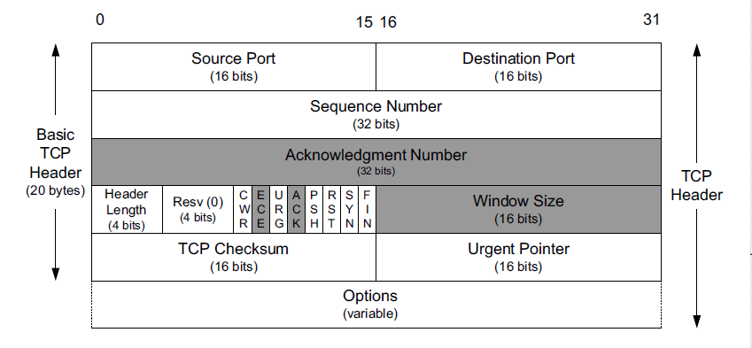

# TCP协议学习—头部

学习TCP之前要先搞清楚TCP的设计目的是什么？解决了哪些问题？

## 灵魂拷问

- WHAT：TCP协议是什么？

  TCP是一个有连接的、可靠的、带流量控制和拥塞控制的端到端的协议字节流协议。

- WHY：为什么会有TCP协议？

  TCP协议提出是为了解决以下几个问题：

  - 如何实现端到端数据传输？
  - 如何解决传输过程的丢包现象？
  - 如何在传输过程中高效利用网络带宽？
  - 如何在复杂的网络环境下进行数据传输？

- HOW：如何解决这些问题？

  - 如何实现端到端数据传输？

    解决端到端的传输问题的核心是如何去区别一个连接？为了解决这个问题，TCP引入了端口的概念。不同的应用进程使用不同的端口，因此通过四元组`(源IP,源端口,目标IP,目标端口)`确定一个TCP连接。

  - 如何解决传输过程的丢包现象？

    传输过程中的丢包现象通过物理手段难见成效，因此只能通过软件手段弥补。这里就有两个问题需要解决：如何识别丢包？识别到丢包怎么处理？他们分别的解决方案是应答机制和重传机制。

    TCP在发出一个报文段后，会启动一个计时器，如果在这个时间内没有收到响应，则会重传该报文段。

  - 如何在传输过程中高效利用网络带宽？

    UDP是面向数据报的，即收到一个报文就发送，当报文超长时，网络层会对其分片，效率低；报文很短时，直接发送，但是浪费带宽。TCP将其视作为一个无结构的字节流，数据块过大时，将数据块进行切分；数据块过短时，则缓冲数据，到合适大小后再发送。

    实现字节流后，又面临一个问题：网络层接收到的报文段可能是乱序的。因此需要为报文段进行统一编号，接收端对报文段进行排序。TCP在建立连接时会互相交换包的初始序列号，发送时为每个报文段编号。

  - 如何在复杂的网络环境下进行数据传输？

    流量控制与拥塞控制。

## TCP头部

TCP协议提供一种面向连接的、可靠的字节流服务。TCP头部基础长度为20字节，最大为60字节，其结构为：

- 端口：用于确定数据的收、发应用。端口号放在最前面的原因是：一个`ICMP`差错报文必须返回引起差错的`IP`数据报中除`IP`首部的前8个字节。当TCP收到一个`ICMP`差错报文时，可以通过端口号确定差错对应的连接。
- 序号：用于标识发送的报文段，为一个32位无符号数，可以通过序号对无序接收到的报文段排序。建立连接时会交换彼此的初始序列号(`ISN`)。
- 确认序号：用于确认已经收到序号，其值为期待的下一个序号，搭配`ACK`使用。
- 类型标识：8个比特位分别为8种类型的标志位。
  - **ECN**：报文接收阻塞
  - **CWR**：窗口已经减少
  - **URG**：紧急数据
  - **PSH**：尽快推送该报文段
  - **SYN**：建立连接
  - **ACK**：应答标记
  - **FIN**：结束发送
  - **RST**：连接不可达
- 校验和：用于校验数据在传输过程中是否受损。

## 参考

- TPC/IP详解 卷1:协议：http://docs.52im.net/extend/docs/book/tcpip/vol1/17/

