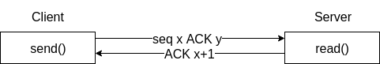
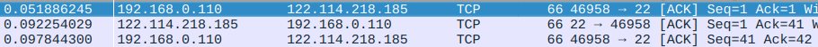
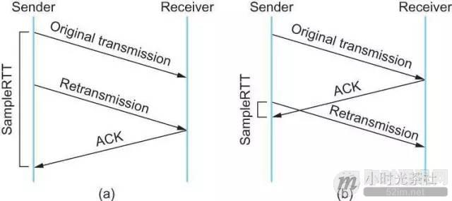
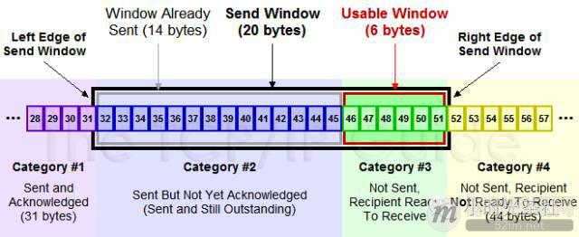

# TCP协议学习—数据传输

## 数据传输

当一端往对端发送数据包时，对端收到数据包后，会发送数据包ACK。

## 实践

- 打开`WireShark`进行抓包，通过`telnet`访问主机。

## 延迟确认机制

TCP协议中，确认序号X表明所有X之前的数据都已经收到。通常情况下，ACK与数据是一同传输，但如果没有数据传输过来，只能单独发送ACK，这会导致消耗大量带宽，网络利用率下降。

RFC建议在收到数据后，延迟一段时间(40ms)看看能不能和接收方要发给发送方的数据一同传输(头部总是包含确认序号)。

- 延迟ACK：如果按序收到两个数据包，则只对第二个包进行ACK，能减少一个ACK，节约带宽。
- 快速ACK：及时通知对方丢包，避免滑动窗口停等，提升吞吐率。

对于乱序到达的TCP数据包，接收端只会确认按序收到的最后一个包序号。

## 重传机制

当数据包丢失，重传机制将负责重传数据包，确保包能准确到达对端。重传机制的三个核心：如何计算超时时间、如何维护定时器、采用什么样的策略进行重传。

### 重传超时计算

超时时间应该是一个动态值：时间过短，可能会出现ACK包还在路上，重传造成带宽浪费、网络拥塞；时间过长导致效率低下。

通常超时时间RTO是依据RTT(数据包发出到收到ACK的时间)进行计算的，主要有三种算法：

- 经典算法：对RTT进行采样，根据采样计算RTO，但其有一个缺陷：采样是按第一次发包后收到ACK的时间计算呢？还是按重传后收到ACK事件计算？

  
  
- Karn/Partridge算法：不对重传的RTT做采样。该算法面对网络波动时(延迟大)，RTO不会得到更新，可能会重传所有的包。

- Jacobson/Karels算法：该算法根据两次测量值的偏差与变化率计算RTO，因此计算的RTO较为准确。

### 定时器维护

定时器维护有两种方案：以包为单位维护定时器、以连接为单位维护定时器：

- 以包为单位：如果为每个包维护一个定时器，这样会导致定时器过多，带来巨大的内存开销和调度开销。

- 以连接为单位：为每个链接维护一个定时器，定时器的数量较为合理。

  - 发送数据包，若没打开定时器，则开启定时器。
  - 若所发出的数据包都已经ACK，则关闭定时器。
  - 若收到ACK，还有数据未被ACK，则重启定时器。
  - 定时器超时后，重传最早未被ACK的数据包。$RTO=min(2*RTO,RTO\_MAX)$，重启定时器。
  

### 重传策略

数据重传可以从两种角度考虑：时间驱动(包的超时)、数据驱动(对端通知丢包信息)。

#### 时间驱动

- 仅重传丢失的数据包。
  - 优点：按需重传，节约带宽。
  - 缺点：速度缓慢，只能重传一个，然后等待超时，重传下一个。
- 重传确认序号后所有的包。
  - 优点：重传速度快。
  - 缺点：会重传不必要的数据包，浪费网络带宽，加剧网络拥塞。

#### 数据驱动

- 快速重传：当连续收到三个确认序号相同的ACK包时，进行重传。
- SACK(选择确认机制)：通过SACK告知详细的丢包信息。

## 流量控制机制

TCP的窗口大小为16bit，其接收窗口的字节容量为$(2^{16}-1)$，最大可扩展为31bit。接收端通过该窗口控制发送端的发送速率，实现端到端的流量控制。

- 发送窗口的实现：发送窗口是一个滑动窗口，其大小和接收端的接收窗口大小相同。分为已发送待确认窗口和可用窗口，当收到ACK后，整个发送窗口向后移动到相应位置。

### 疑问

- 如果接收端发送一个零窗口给发送端，发送端如何处理？

  收到一个零窗口后，发送端不能再发送数据，但它可使用主动探测机制(ZWP)即时探测接收方窗口：发送端在收到零窗口后，发送ZWP包给接收端(三次，间隔30~60s)探测接收方窗口。

- 接收端处理能力慢，导致窗口很快被填满，当出现空出几个字节窗口时，如果立即通知发送端，则会导致浪费带宽(发送小包)，这种情况下如何处理？

  该问题的本质是如何避免发送大量小包，可用从两个角度解决该问题：
  
  - 当接收端的接收窗口小于某个值后，直接发送零窗口，阻止发送端发送数据，等窗口大于MSS或缓冲区有一半为空，再发送非零窗口。
  - 发送端采用Nagle算法避免发送小包：当数据包长度达到MSS时才能发送，如有特殊情况也可以立即发送(设置了FIN、TCP_NODELAY、超过200ms)。Nagle算法还有一个特殊选项：设置了TCP_CORK后，若所发小数据包都被确认，则允许发送(保证最多发一个小包)。
  - Nagle算法和延迟确认一起，当出现`write-write-read`时，可能会出现一个40ms延时问题：发送第一个小包后，根据Nagle算法，必须在收到第一个ACK或200ms超时才能发小包；接收端收到包后，延迟确认机制会等待下一个包，因此进入死锁状态，接收端超时40ms后，才会发送ACK。

## 拥塞控制机制

网络拥塞的本质：大家都想独占整个网络资源。TCP只能看到对端的接收能力，而无法感知链路上的容量，如果以很大速率发包，则会导致链路拥堵(数据包守恒：带宽不变，同一时刻能容纳数据包数量恒定)，从而引发重传风暴，进一步加剧链路拥堵，因此必须实时控制发包速度。Reno算法时拥塞控制中应用最广泛且较为成熟的算法，分为：慢启动、拥塞避免、快速重传、快速恢复四个阶段。

- 冗余ACK：没有带来有效信息的包，如没有数据、纯ACK包(没有FIN或SYN)、没有更新确认号或窗口，没有ACK最新发出的包。
- 慢热启动
  - 初始化$cwnd=N$，表明可以传N个MSS大小的数据。
  - 每收到一个ACK，$cwnd=cwnd+1$，呈线性上升。
  - 每过一个RTT，$cwnd=cwnd*2$，指数上升。
  - 当$cwnd \geq ssthresh$(容量为65535字节)时，进入拥塞避免。
- 拥塞避免
  - 每收到一个ACK，则$cwnd=(cwnd+1/cwnd)$。
  - 每过一个RTT，$cwnd=cwnd+1$。
  - 出现RTO超时，重传包，$ssthresh=cwnd/2，cwnd=1$，进入慢启动状态。
  - 若出现RTO超时前，收到三个冗余ACK，则表示中间有部分包丢失，但是拥塞不严重，因此窗口不易大幅度变化，进入快速重传。
- 快速重传
  - $ssthresh=cwnd/2，cwnd=ssthresh$。
  - 进入快速恢复。
- 快速恢复：核心思想是数据包守恒，收到一个ACK，意味着有一个包被收到了，能多发一个包。
  - $cwnd=cwnd+3$，重传冗余ACK要求的数据包。
  - 收到冗余ACK，$cwnd=cwnd+1$。
  - 收到新ACK，$cwnd=sshthresh$，进入拥塞避免。
  - 缺点：3个冗余ACK如果面临丢失了多个包，快速重传只重传了一个包，其他包只能等待RTO超时，ssthresh会减半，进入慢启动状态。多个超时会导致TCP传输速率呈指数下降。因此Reno算法会重传冗余ACK要求的包，如果重传后的ACK告知所发出的数据都收到了，则只丢失了一个包，否则丢失多个，会重传窗口未被ACK的第一个包，直到所发的包都ACK后，才进入拥塞避免(SACK会携带要重传的信息)
- 拥塞避免阶段，cwnd是线性增加，出现拥塞时采取指数递减，这是基于公平性原则，因为窗口增加只有利于自己，减少有利于大家。

- TCP发送窗口处于稳定状态
  - 接收端大窗口锯齿状：TCP接收端拥有较大窗口，每个TCP公平竞争网络带宽，在慢启动和拥塞避免之间转变。
  - 接收端小窗口直线状：接收端速度慢，发送窗口小，因此数据量小，避免拥塞，因此发送窗口处于慢慢直线增加。
  - 满载直线状态：只存在于两端直连且只要一个连接。