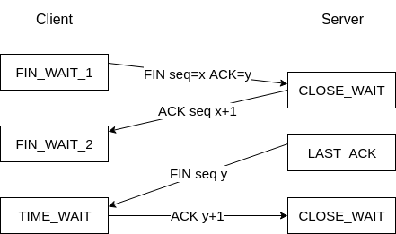
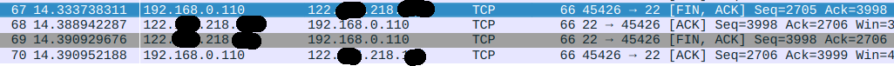
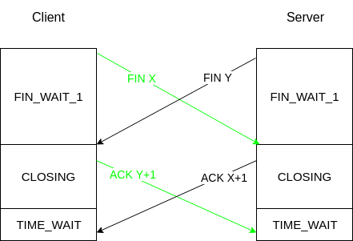

# TCP协议学习—断开连接

## 断开连接

`TCP`连接是全双工，因此每个方向都要单独进行关闭操作：

- `A`完成数据传输任务后，发送`FIN`包，等到`B`的`ACK`包后，即可终止`A->B`的方向数据传输，进入了半关闭状态。
- 这时`B`还能继续向`A`发送数据，当`B`完成相关处理后，发送`FIN`包，断开`B->A`方向数据传输，整个连接才算关闭。

- TCP断开连接的目的
  - 终止数据传输
  - 回收资源
- 具体流程
  - Client发送FIN包，告知Server完成数据传输。
  - Server收到后，回复ACK包，确认对方的请求。
  - Server处理完后续事项后，发送FIN包，告知Client完成后续操作。
  - Client收到后，回复ACK包，断开连接成功。

## 实践

- 打开`WireShark`进行抓包，通过`telnet`访问主机。

## 疑问

### 如何处理同时关闭连接？

### 为什么会有TIME_WAIT状态？

TIME_WAIT状态主要是为了解决3个问题：

- 当主动关闭方发送被动关闭方的FIN包的ACK后，直接关闭连接，若该ACK在传输过程中出现了丢包，导致被动关闭方没有收到该ACK，则会重发FIN包，主动关闭方无法识别该FIN，则会回复RST包。被动关闭方永远得不到ACK，无法正常关闭该连接。因此主动关闭方需要进入TIME_WAIT状态，其时间长度为`2*MSL`(通常一个MSL为30s)。
- 当新连接重用旧连接四元组时，如果新连接收到了旧连接FIN包，则可能会导致断开连接(因为ISN时随机生成的，有一定概率导致序列号相同)。
- 新连接重用旧连接的四元组时，旧连接中残余数据包会干扰正常数据包。
- 综合这三点原因，TIME_WAIT解决了两个问题：ACK包丢包和保证残余数据包失活。

但是TIME_WAIT也带来了几个问题：、

- TIME_WAIT状况会需要耗时`2*MSL`，Client短时间大量短连接会导致端口耗尽；Server短时间关闭连接，会出现大量TIME_WAIT连接，消耗服务器资源。

### 如何快速回收TIME_WAIT？

快速回收需要打开`tcp_tw_recycle`和`tcp_timestamps`，快速回收时间为`3.5*RTO`。快速回收机制为了避免`TIME_WAIT`的三个问题，必须保证老的数据包将被拒绝，因此当同一对端在`MSL`内有TCP数据到达该Server，并且其时间戳小于上次TCP数据的时间戳时，这个数据包将被拒绝掉。

快速回收机制中，在面临有`NAT`的情况下，可能会出现误杀。NAT后面所有的节点都将被视为一个节点，因此如果出现这些节点的时间戳不一致的情况，则会导致关闭时间戳快的节点连接时，快速回收会误杀时间戳慢的节点的连接。

### 如何重用四元组？

重用需要打开`tcp_tw_reuse`和`tcp_timestamps`，当满足以下条件之一就可以重用：

- 新连接SYN的初始序列号比TIME_WAIT旧连接的最后一个序列号大。
- 新连接的时间戳比旧连接的时间戳大。

重用TIME_WAIT的必须满足的条件是收到最后一个数据包超过1s。

### 如何控制TIME_WAIT数量？

- 修改`tcp_max_tw_buckets`，用于控制TIME_WAIT的数量，默认值为180000.
- 通过RST包清理TIME_WAIT。

