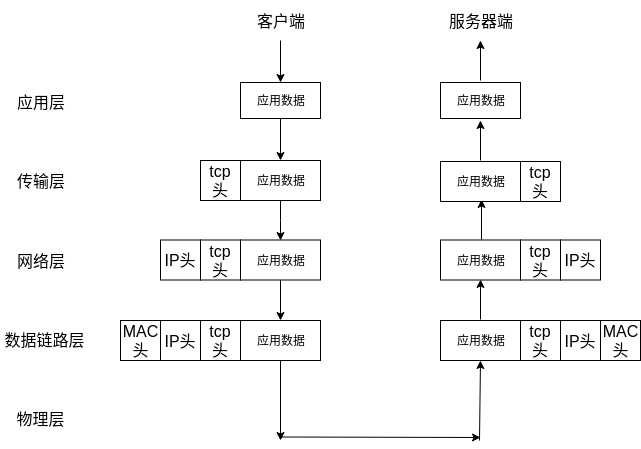

# 网络协议分层

## 分层
网络中的任意一个操作都会涉及到与物理设备的操作，为了更好的实现复用、封装复杂度，ISO将网络协议划分为7层(从下往上)：物理层、数据链路层、网络层、传输层、会话层、表示层、应用层。实际实现时，为五层协议，最后的三层统一被称为应用层。

## 浏览器应用数据包流程

### 物理层

物理层负责通过物理手段实现节点连接和传递电信号(0,1)，如光纤、网线和无线电波等。

### 数据链路层

物理层为我们实现了节点的连接与电信号传递后，将面临解决三个问题：

- 数据与电信号是如何转换的？
- 数据帧是如何传递的？
- 如何判断发送过来的数据是否属于该节点的呢？

数据链路层中的以太网协议提供了解决方案：

- 数据与电信号是如何转换的？

  以太网协议将数据链路层中处理的信息称作为帧。数据链路层将帧编码为电信号和将电信号解码为数据。帧由两部分组成：头部`Head`和数据`Data`。头部大小为18个字节，其包含数据包的相关信息(发送者、接收者、数据类型)。数据大小范围为：`46-1500`字节，因此一个帧的大小范围为`64-1518`字节，如果数据的过大，就必须切割为多个帧发送。

- 数据帧是如何传递的？

  帧转换为电信号后，在以太网中以广播形式传播，同一以太网的所有节点都会收到该帧。

- 如何判断发送过来的帧是否属于该节点的呢？

  帧头部中存储了帧的源`MAC`地址与目标`MAC`地址。`MAC`地址是网卡的身份标识，节点通过`MAC`地址识别包的发送者与接收者。

- 如何获取接收者的`MAC`地址？

  网络层会通过`ARP`协议获取目标节点的`MAC`地址。

### 网络层

以太网通过广播的形式发送数据，这种方式只能在节点数量很少的情况下使用(想象一下你春运时在全国最大的火车站广场通过靠吼的形式找你的女朋友)。为了解决这个问题，最好的方式是将节点拆分到多个以太网中，然后通过网关连接以太网(后面称之为子网)。网络层负责跨子网传输数据。要想做好这件事，必须解决一下几个问题：

- 如何判别节点在那个子网中？

  `MAC`地址好比人的身份证号，通过身份证号并不能判断一个人现在在哪，只能知道这个人是在哪出身的。但是我们可以通过居住地址了解到这个人住哪，然后去到这个地方，再通过身份证号找人(是的，网络和现实就是这么相似)。

  出于这个原理，网络层中的IP协议为每个提供了`IP`地址，`IP`地址又分为`IPv4`和`IPv6`。用IP地址跟子网掩码按位与就能判断节点在哪个子网中，把数据传递到该子网后，再通过广播的形式传播。

- 如何判断包是否属于该节点？

  使用`IP`协议发送的数据，被称作为`IP`数据包。`IP`数据包由两部分组成：头部`Head`和数据`Data`。头部长度范围为`20-60`字节，其包含协议版本、包、源`IP`和目标`IP`等信息。数据长度最大为`65515`字节。

- 如何获取接收者的`MAC`信息？

  `ARP`协议会广播一个数据包，数据包中存放了目标`IP`，目标`MAC`被设置为`FF:FF:FF:FF:FF:FF`，这时就有两种可能性：

  - 接收者在子网中：接收者取出`ARP`中的目标`IP`与自己的`IP`相对比，如果匹配，则发出相应包，包中存放了自己的`MAC`地址。
  - 接收者在其他子网中：将ARP包的目标`MAC`设置为网关的`MAC`，网关会将包转发到相应子网中，进行处理。

- 如何获取`IP`呢？

  `IP`可以通过两种方式进行设置：静态`IP`和动态`IP`。采用静态`IP`则需要你手动为节点配置`IP`地址、网关、子网掩码。

  采用动态`IP`方式，指节点会自动从`DHCP`服务器中申请`IP`地址及配置信息。`DHCP`协议采用`UDP`协议，在请求包中，将源`IP`设置为`0.0.0.0`(自己没`IP`)，目标`IP`设置为`255.255.255.255`(`DHCP`服务器`IP`地址也不知道)，然后广播出去(广播`MAC`为`FF:FF:FF:FF:FF:FF`)，`DHCP`服务器根据源`IP`和目标`IP`的内容，判断这是`DHCP`请求包，然后配置`IP`信息，广播响应包，响应包中，目标`IP`为`255.255.255.255`。

### 传输层

通过`MAC`地址与`IP`地址，我们能在任意两个节点之间建立通信，但这又有一个问题了，我们的节点如何运行多个网络程序呢？传输层将解决这个问题。

传输层提出了端口概念，端口是一个16位2进制的编号，其范围为`0-65535`。不同的端口对应着不同的程序，通过端口，传输层实现了端到端的通信，Unix中将主机+端口称之为套接字(`Socket`)。端口序号中`0-1023`是由系统所使用，我们只能使用1023之后的端口号。

传输层中两个重要的协议是：

- `UDP`协议

  `UDP`数据包由两部分组成：头部`Head`和数据`Data`。头部包含源端口号和目标端口号，其大小为`8`个字节。整个`UDP`数据包的大小不能超过`65515`字节。`UDP`协议非常简单，但也带来了很大的问题：可靠性差。因此如果想要使用`UDP`协议，最好自己实现可靠性解决方案。

- `TCP`协议

  `TCP`协议和`UDP`协议类似，但其通过确认机制提供了高可靠的网络传输协议，但是这也带来实现复杂、资源消耗过多等问题。

### 应用层

应用层负责处理传输层传递过来的数据转换为相应的数据格式，如基于`TCP`的`HTTP`协议、`FTP`协议。这些都是由开发者自定义的。

## 相关设备

- 集线器：集线器作用于物理层，将电信号转发给所有端口。
- 交换机：交换机作用于数据链路层，根据目标`MAC`，将包转发到相应端口。
- 路由器：路由器作用于网络层，根据`IP`地址与子网掩码，将包转发到相应的子网。

## 思维导图

## 参考

- 网络编程懒人入门(一):快速理解网络通信协议(上篇):http://www.52im.net/thread-1095-1-1.html
- 网络编程懒人入门(一):快速理解网络通信协议(下篇):<http://www.52im.net/thread-1103-1-1.html>

