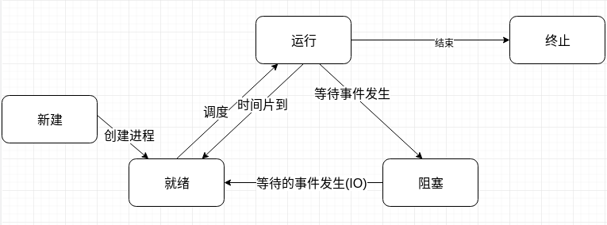

# I/O模型

> 这篇文章是知乎关于《怎样理解阻塞非阻塞与同步异步的区别》话题的整理。

阻塞、非阻塞、同步、异步这四个概念在网络编程中是难以避开的，学习这四个概念又要牵扯出I/O模型这个概念，在查找相关资料时，找到了几本相关书籍(主要都是与操作系统有关)，大家可阅读一下：

- 《操作系统概念》
- 《现代操作系统》
- 《Unix网络编程》
- 《深入理解计算机系统》

路漫漫其修远兮，吾将上下而求索。

## 同步、异步、阻塞、非阻塞

同步和异步关注的是消息通信机制。

- 同步：调用者发出同步调用后，只有当返回结果后，才会往后继续运行。
- 异步：调用者发起异步调用，只是通知被调用者需要完成的任务，被调用者通过消息机制通知调用者(状态、通知、回调)

消息通信机制。

- 状态：需要调用者定期检查状态信息，效率低。
- 通知：调用者只需等待被调用者返回的通知即可。
- 回调函数：当处理完后，通过回调函数来通知调用者。

阻塞和非阻塞关注的是调用者等待调用结果时的状态。

- 阻塞：调用者等待结果时，什么都不能干。
- 非阻塞：调用者等待结果时，可以干其他事。

这两组概念进行两两交互则出现四种情况：

| 形式       | 描述                                                     | 性能 |
| ---------- | -------------------------------------------------------- | ---- |
| 同步阻塞   | 等待消息返回时不能做其他操作                             | 最低 |
| 异步阻塞   | 等待消息机制通知时不能做其他操作                         | 低   |
| 同步非阻塞 | 等待消息返回时，调用者切换到其他任务上(切换任务消耗资源) | 低   |
| 异步非阻塞 | 调用者切换到其他任务上，但可以通过消息机制通知它         | 最高 |

## 操作系统

操作系统作为计算机系统的核心与基石，程序的任何操作都必须由操作系统去协调计算机资源，因此从操作系统层次学习`I/O`模型才能理解其背后的含义。

计算机硬件主要分为三大部分：

- CPU：负责执行程序。
- 内存：暂存CPU需要执行的程序与数据。
- I/O设备：负责与外界进行交互。

### 内存

现代操作系统为了能支持多个应用同时运行，需要将多个进程相互隔离，以确保不会互相干扰。为了能更好调度与管理用户进程，操作系统内核拥有比用户进程更高的权限，这样内存空间就被分为了两部分：

- 内核空间
- 用户空间

内存访问的相关硬件会在程序执行期间进行访问控制，确保用户空间的程序不能直接读写内核空间。

### 进程五态

进程在整个生命周期中，有五个状态：

- 新建：创建新进程。
- 就续：进程等待被操作系统调度。
- 运行：CPU执行进程的相关指令。
- 阻塞：等待事件发生，不会占用CPU资源。
- 终止：进程结束。

这五个状态之间的切换如下图：

进程从运行态进入阻塞态的情况有两种：

- 中断：CPU中有中断信号位，每个CPU时钟周期的末尾，CPU通过检查中断信号位判断是否有中断到达，如果有，则根据优先级决定是否暂停当前的指令，去执行处理中断的指令(CPU层次while轮询)。
- 系统调用：让操作系统内核完成特定操作，通常为I/O操作。

处理系统调用时，CPU需要与IO设备进行交互，涉及了阻塞与非阻塞问题，CPU可以阻塞式等待IO设备返回结果，也可以非阻塞式的继续执行其他操作，通常处理`I/O`时采用异步非阻塞方式(CPU发起`I/O`请求后，不会等待`I/O`完成，继续执行其他指令，当IO设备中断到达后，再去读取相应设备缓冲区)。

## I/O模型

操作系统中大多数`I/O`操作是缓存I`/O`，数据会被先拷贝到内核缓存区中，再从内核缓冲区拷贝到用户空间，这样能减少读盘的次数，从而提高性能。但是这也带来一个缺陷，用户空间的数据与`I/O`设备之间的数据进行交互时，必须要通过内核空间，这会带来额外的CPU和内存开销。因此一个读操作，会经历两个阶段：

- 等待数据写入内核缓冲区。
- 从内核缓存去中复制到进程缓冲区。

网络`I/O`的本质是对`socket`的读写。在Linux中，`socket`文件被视作为流文件。网络`I/O`的模型有五种：

- 阻塞式`I/O`模型(同步阻塞)：系统调用返回时已经将数据从内核空间复制到用户空间中了。

- 非阻塞式`I/O`模型(同步非阻塞)：调用后立即返回`EWOULDBLOCK`错误，调用进程主动轮询内核是否将数据准备好了，准备好后，进数据从内核空间复制到用户空间。

- `I/O`复用模型：进程会阻塞在`select`、`poll`、`epoll`中，而不会阻塞在`I/O`系统调用上。
	`I/O`复用模型中的复用体现在，同时监听多个`I/O`，其实现的核心是socket wakeup callback机制。内核会为该socket建立一个等待队列，当有`socket`事件发生时，则意味着队列中某个进程等待的`socket`准备好了，内核会唤醒等待队列中的每个进程，并调用其回调函数。
	- `select`：高性能网络服务上，一个进程会同时处理多个`socket`，当那个`socket`准备好了，就先处理那个`socket`。`select`会将进程同时加入所关注的`socket`等待队列，当进程被唤醒时，通过回调函数检查哪些`socket`准备好了，`select`会返回准备好的`socket`。
	  - 缺点：
	    - `socket`集合太小，最大为1024。
	    - `socket`集合要从用户空间拷贝到内核空间，开销大。
	    - 遍历所监听的`socket`开销太大。
	- `poll`：只是解决`select`的`socket`集合小的问题。
	- `epoll`：

- 信号驱动模型：信号驱动模型和`I/O`复用类似，只是通过信号通知进程已经数据已经准备好了。

- 异步`I/O`模型：异步`I/O`中，当发起调用后，会立即返回等待通知。通知到达，则意味着数据已经准备好了，只待处理。

## 参考

- 直接`I/O`的动机：https://www.ibm.com/developerworks/cn/linux/l-cn-directio/
- 大话`select`、`poll`、`epoll`：https://cloud.tencent.com/developer/article/1005481
- 《UNIX网络编程 卷1：套接字联网API（第3版）》